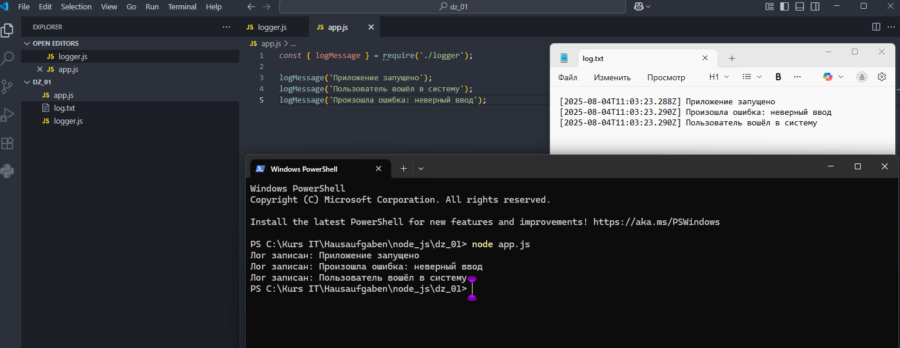

# Домашняя работа 1

### Задание 1. Создание простого логгера с использованием встроенного модуля `fs`

1. Создайте новый проект.

- Откройте ваш редактор кода и создайте новую директорию для проекта, например, `simpleLogger`.

2. Создайте файл для логгера.

- Внутри директории проекта создайте файл с именем `logger.js`.

3. Импортируйте модуль `fs`.

- В начале файла `logger.js` импортируйте встроенный модуль `fs`.

4. Создайте функцию для записи логов.

- Создайте функцию `logMessage`, которая принимает сообщение и записывает его в файл `log.txt`.

5. Используйте метод `fs.appendFile`.

- Внутри функции используйте метод `fs.appendFile` для добавления нового сообщения в файл `log.txt`.

6. Создайте основной файл проекта.

- Создайте новый файл с именем `app.js`.

7. Импортируйте ваш логгер.

- В начале файла `app.js` импортируйте ваш модуль `logger`.

8. Запишите несколько логов.

- Используйте функцию `logMessage`, чтобы записать несколько сообщений в лог.

9. Запустите ваш скрипт.

- В терминале перейдите в директорию проекта и выполните команду `node app.js` для запуска скрипта.

10. Проверьте результаты.

- Откройте файл `log.txt` и убедитесь, что все сообщения были успешно записаны.
---

