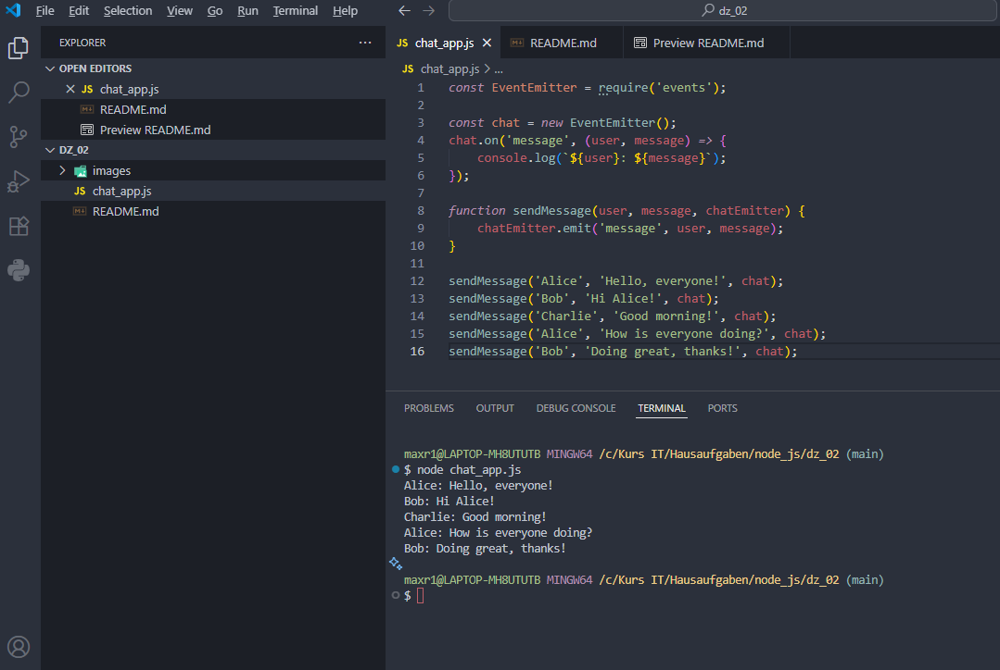

# Домашняя работа 2

### Задание 1. Чат-приложение

1. Создайте новый файл с именем `chat_app.js`.

2. Импортируйте модуль `events` и создайте экземпляр `EventEmitter`.

3. Напишите функцию `sendMessage`, которая принимает имя пользователя, сообщение и объект `EventEmitter`.

4. Внутри функции `sendMessage` генерируйте событие `message` с именем пользователя и сообщением.

5. Зарегистрируйте обработчик для события `message`, чтобы выводить сообщение в формате "User: Message".

6. Вызовите функцию `sendMessage` несколько раз с разными пользователями и сообщениями.

---

