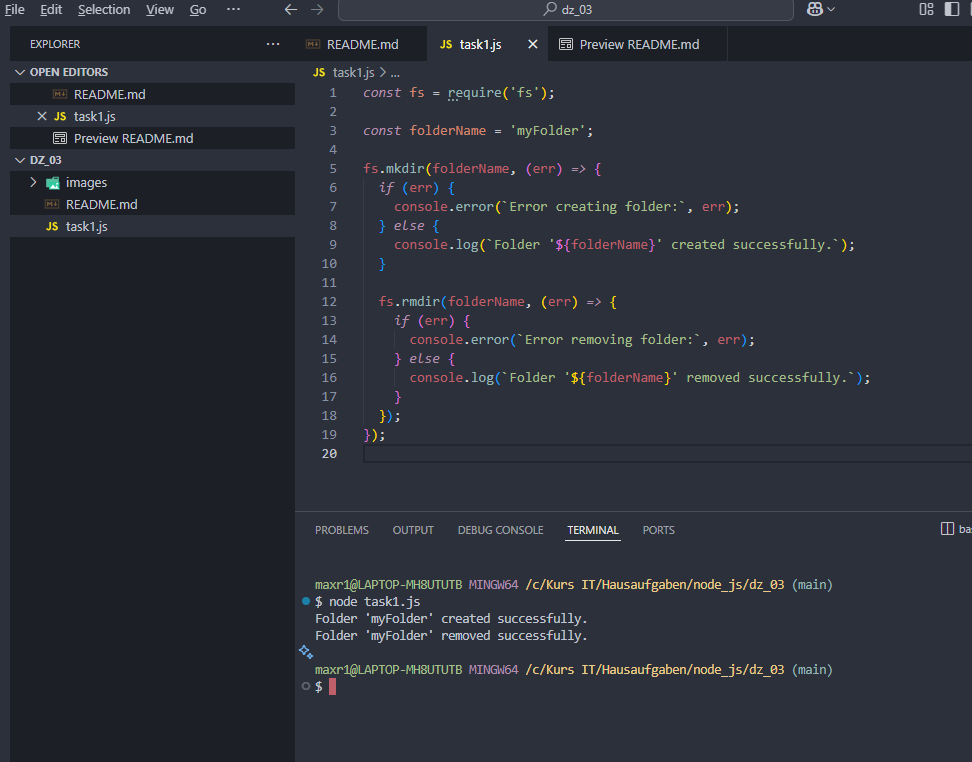
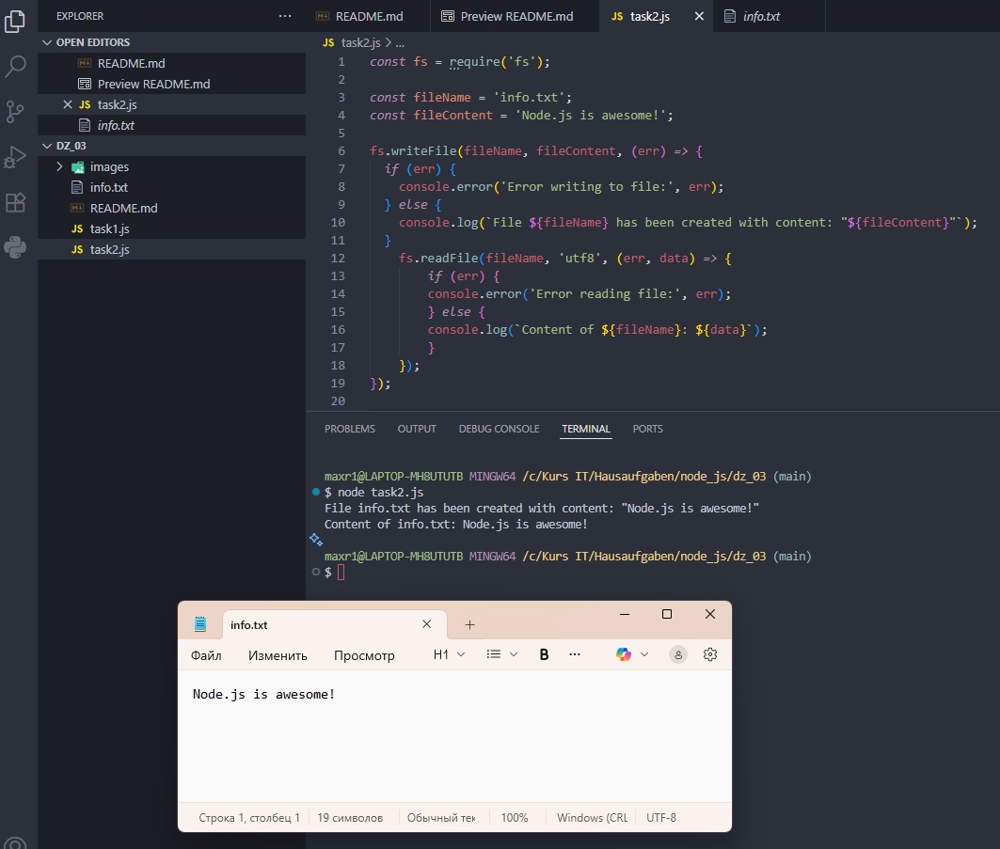

# Домашняя работа 3

### Задача 1. Создание и удаление каталога

1. Создайте новый файл для скрипта, например, `task1.js`.

2. Импортируйте модуль `fs`.

3. Создайте каталог с именем `myFolder` в текущей директории.

- Используйте метод `fs.mkdir` для создания каталога.
- В функции обратного вызова (callback) обработайте возможные ошибки и выведите сообщение о успешном создании.

4. Удалите каталог `myFolder`.

- Используйте метод `fs.rmdir` для удаления каталога.
- В функции обратного вызова (callback) обработайте возможные ошибки и выведите сообщение о успешном удалении.

---

---

### Задача 2. Чтение и запись файла

1. Создайте новый файл для скрипта, например, `task2.js`.

2. Импортируйте модуль `fs`.**

3. Создайте файл с именем `info.txt` и запишите в него текст "Node.js is awesome!".

- Используйте метод `fs.writeFile` для записи текста в файл.
- В функции обратного вызова (callback) обработайте возможные ошибки и выведите сообщение о успешной записи.

4. Прочитайте содержимое файла `info.txt`.

- Используйте метод `fs.readFile` для чтения содержимого файла.
- В функции обратного вызова (callback) обработайте возможные ошибки и выведите содержимое файла на консоль. 

---

