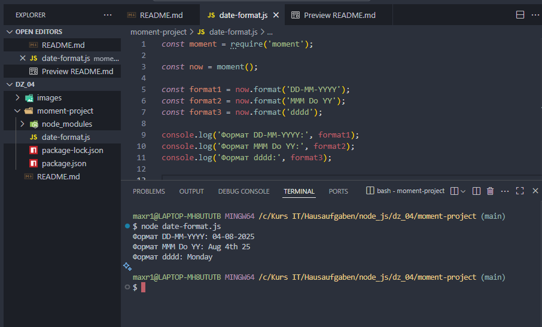
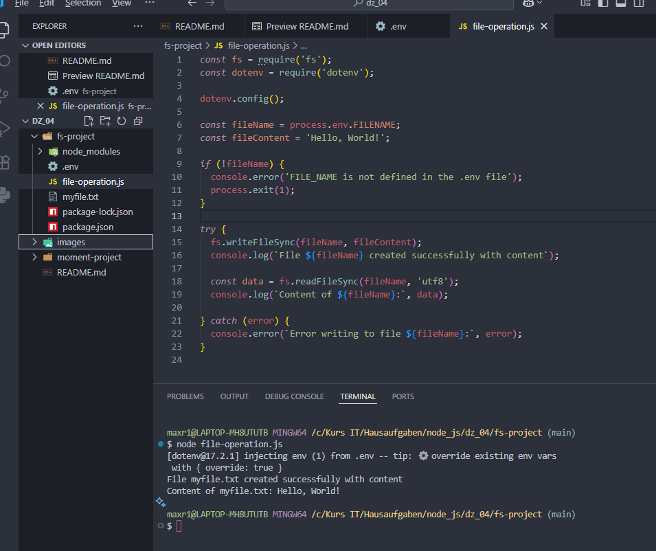

# Домашняя работа 4

### Задача 1. Использование moment для форматирования даты и времени

1. Создайте новый проект:

- В терминале перейдите в каталог, где хотите создать проект.
- Запустите команду `npm init -y`, чтобы создать файл `package.json`.

2. Установите moment:

- Выполните команду `npm install moment`.

3. Создайте файл `date-format.js`:

- Создайте файл `date-format.js` в корневом каталоге проекта.

4. Используйте moment для форматирования текущей даты и времени:

- Импортируйте модуль `moment`.
- Получите текущую дату и время.
- Отформатируйте текущую дату и время в форматах: `DD-MM-YYYY`, `MMM Do YY`, `dddd`.

5. Выведите результаты в консоль:

- Запустите скрипт командой `node date-format.js`.

---

---

### Задача 2.  Создание и чтение текстового файла с использованием fs и dotenv

1. Создайте новый проект:

- В терминале перейдите в каталог, где хотите создать проект.
- Запустите команду `npm init -y`, чтобы создать файл `package.json`.

2. Установите dotenv:

- Выполните команду `npm install dotenv`.

3. Создайте файл `.env`:

- Создайте файл `.env` в корневом каталоге проекта.
- Добавьте строку `FILENAME=myfile.txt`, чтобы задать имя файла.

4. Создайте файл `file-operation.js`:

- Импортируйте модули `fs` и `dotenv`.
- Загрузите переменные окружения из файла `.env`.
- Создайте текстовый файл с именем, указанным в переменной окружения `FILENAME`, и запишите в него любой текст.
- Прочитайте содержимое файла и выведите его в консоль.

5. Запустите скрипт командой `node file-operation.js`.

---

