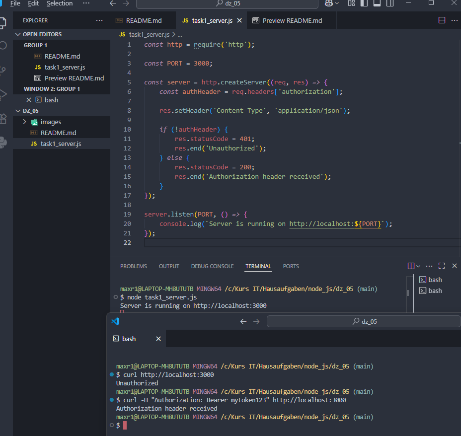
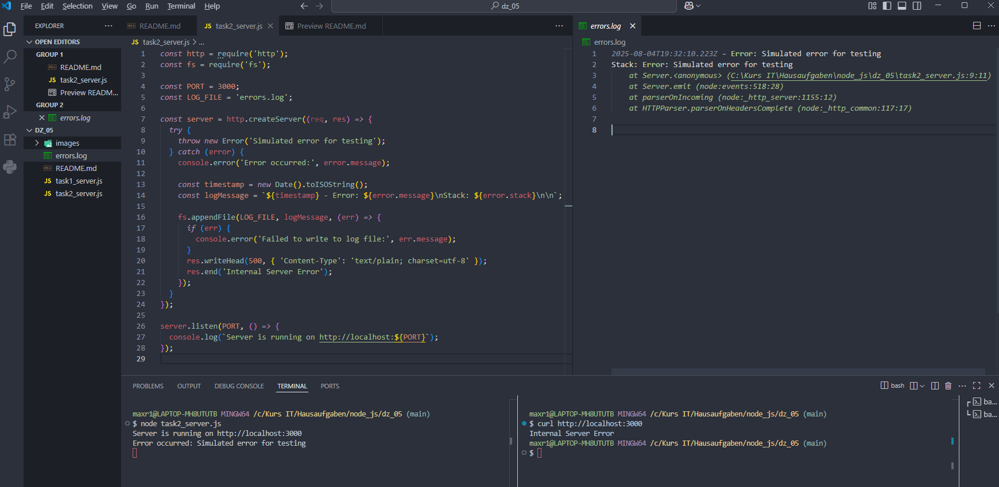
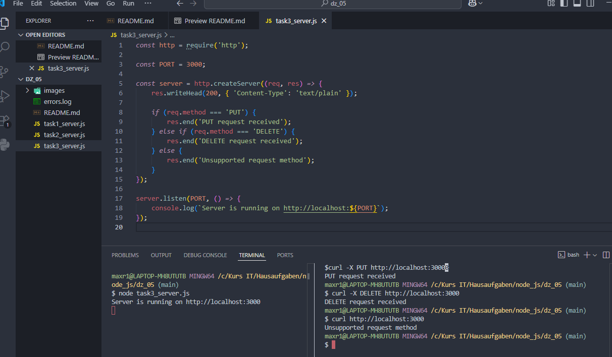

# Домашняя работа 5

### Задача 1. Работа с заголовком Authorization

1. Создание сервера:
    
- Импортируйте модуль `http`.
- Создайте сервер с использованием метода `http.createServer()`.

2. Проверка заголовка Authorization:

- В функции обратного вызова для сервера проверяйте наличие заголовка `Authorization` в объекте `req.headers`.
- Если заголовок отсутствует, возвращайте статус ответа `401` и сообщение "Unauthorized".
- Если заголовок присутствует, возвращайте статус ответа `200` и сообщение "Authorization header received".

3. Формирование ответа:
    
- Установите соответствующий статус ответа и заголовок `Content-Type` в `text/plain`.
- Отправьте текстовый ответ в зависимости от наличия заголовка `Authorization`.

4. Запуск сервера:
    
- Настройте сервер на прослушивание порта `3000`.
- Добавьте сообщение в консоль, которое будет выводиться при успешном запуске сервера.

---

---

### Задача 2. Логирование ошибок сервера

1. Создание сервера:
    
- Импортируйте модули `http` и `fs`.
- Создайте сервер с использованием метода `http.createServer()`.

2. Обработка запросов:
    
- В функции обратного вызова для сервера специально вызывайте ошибку для тестирования.
- Используйте конструкцию `try-catch` для перехвата ошибок.
- Логируйте ошибки в файл `errors.log` с помощью метода `fs.appendFile()`.

3. Формирование ответа:
    
- Установите статус ответа `500` и заголовок `Content-Type` в `text/plain`.
- Отправьте текстовый ответ с сообщением "Internal Server Error".

4. Запуск сервера:
    
- Настройте сервер на прослушивание порта `3000`.
- Добавьте сообщение в консоль, которое будет выводиться при успешном запуске сервера.

---

---

### Задача 3. Обработка PUT и DELETE запросов
  
1. Создание сервера:
    
- Импортируйте модуль `http`.
- Создайте сервер с использованием метода `http.createServer()`.

2. Обработка PUT и DELETE запросов:
    
- В функции обратного вызова для сервера проверяйте метод запроса (`req.method`).
- Если метод запроса `PUT`, возвращайте статус ответа `200` и сообщение "PUT-запрос обработан".
- Если метод запроса `DELETE`, возвращайте статус ответа `200` и сообщение "DELETE-запрос обработан".

3. Формирование ответа:
    
- Установите соответствующий статус ответа и заголовок `Content-Type` в `text/plain`.
- Отправьте текстовый ответ в зависимости от метода запроса.

4. Запуск сервера:
    
- Настройте сервер на прослушивание порта `3000`.
- Добавьте сообщение в консоль, которое будет выводиться при успешном запуске сервера.  

---

