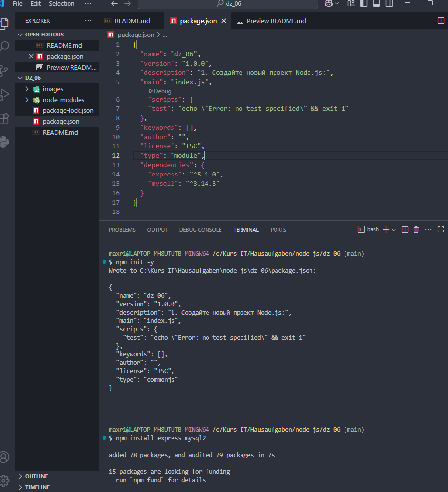
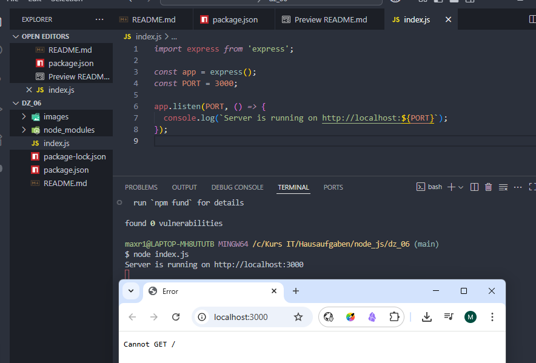
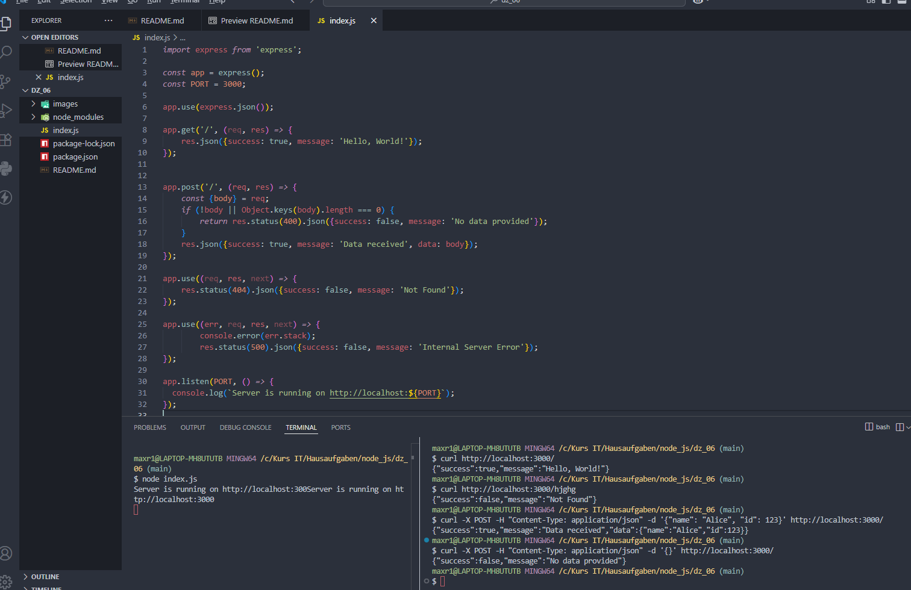
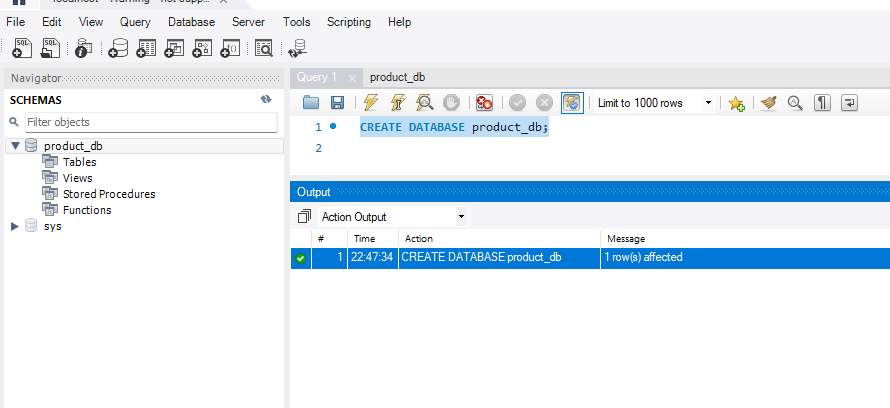
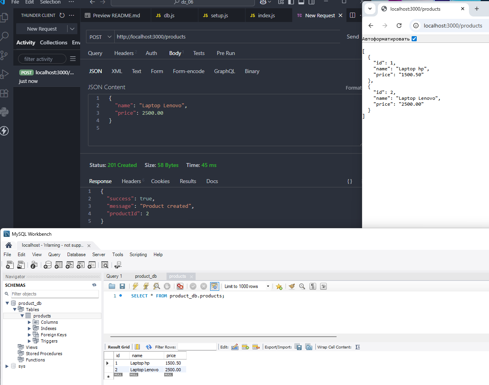

# Домашняя работа 6

### Задание 1. Создание проекта Node.js и установка в него Express.js

1. Создайте новый проект Node.js:
 
- Откройте терминал или командную строку на вашем компьютере.
- Перейдите в директорию, где вы хотите создать проект.
- Запустите команду `npm init -y`, чтобы инициализировать новый проект.

2. Установите зависимости:

- После инициализации проекта установите Express.js и MySQL2, выполнив команду `npm install express mysql2`.
- Проверьте, что Express.js установлен, посмотрев список зависимостей в файле `package.json`, настройте зависимость “type”: “module”.

---

---

### Задание 2. Создание Express сервера

1. Создайте основной файл сервера:
   
- В корневой папке проекта создайте файл `index.js`.
- Откройте этот файл в текстовом редакторе.

2. Настройте Express сервер:
    
- Импортируйте модуль Express в вашем `index.js`.
- Создайте экземпляр приложения Express и задайте порт, на котором будет работать сервер.
- Настройте сервер так, чтобы он прослушивал запросы на определенном порту и выводил в консоль сообщение о запуске.

3. Запустите сервер:
    
- В терминале выполните команду `node index.js`, чтобы запустить сервер.
- Откройте браузер и перейдите по адресу `http://localhost:3000`, чтобы убедиться, что сервер работает (должен быть ответ или сообщение об ошибке).

---

---

### Задание 3. Создание маршрутов POST и GET с обработкой ошибок

1. Создайте маршруты для GET и POST запросов:
    
- В файле `index.js` добавьте маршрут `GET /`, который будет возвращать простое сообщение (например, "Hello, World!").
- Добавьте маршрут `POST /`, который будет обрабатывать данные, отправленные в запросе, и возвращать ответ.

2. Добавьте обработку ошибок:
    
- Для маршрута `GET /` настройте обработку ошибок на случай, если что-то пойдет не так (например, неправильный путь).
- Для маршрута `POST /` добавьте проверку полученных данных и обработку ошибок (например, если данные не были отправлены).

3. Проверьте работу маршрутов:
    
- Запустите сервер и протестируйте оба маршрута с помощью браузера или инструмента вроде Postman.
- Убедитесь, что маршруты работают корректно и ошибки обрабатываются надлежащим образом. 

---

---

### Задание 4. Создание и настройка базы данных в MySQL

1. Установите MySQL (если еще не установлено):
    
- Если у вас еще не установлен MySQL, скачайте и установите его с официального сайта.
- После установки убедитесь, что MySQL сервер запущен.

2. Создайте базу данных `product_db`:
    
- Откройте MySQL Workbench или подключитесь к серверу MySQL через командную строку.
- Создайте новую базу данных с названием `product_db` с помощью команды `CREATE DATABASE product_db;`.
- Убедитесь, что база данных создана корректно, используя MySQL Workbench или командную строку.

---

---

### Задание 5. Подключение Express приложения к базе данных и создание маршрутов

1. Настройка подключения к базе данных:
    
- В корневой папке вашего проекта Node.js создайте файл `db.js`.
- В файле `db.js` настройте параметры подключения к базе данных `product_db` (хост, пользователь, пароль, название базы данных).
- Убедитесь, что подключение настроено корректно.

2. Создание файла для инициализации таблицы:
    
- Создайте новый файл `setup.js` в вашем проекте.
- В файле `setup.js` настройте подключение к базе данных, используя `db.js`.
- Создайте таблицу `products` с полями:

    - `id` — уникальный идентификатор продукта (целое число с автоинкрементом).
    
    - `name` — название продукта (строка).
    
    - `price` — цена продукта (десятичное число).
    
- Запустите файл `setup.js`, чтобы создать таблицу в базе данных `product_db`. Убедитесь, что таблица создана успешно.

3. Создание маршрутов для работы с базой данных:
    
- Откройте файл `index.js`.
- Импортируйте Express и подключение к базе данных из `db.js`.
- Создайте маршрут `GET /products`, который будет выполнять SQL-запрос для получения всех записей из таблицы `products` и возвращать их клиенту в формате JSON.
- Создайте маршрут `POST /products`, который будет принимать данные из тела запроса (например, `name` и `price`), выполнять SQL-запрос на вставку новых данных в таблицу `products`, и возвращать результат операции (например, сообщение о том, что продукт успешно добавлен).

4. Проверьте работу маршрутов:
    
- Запустите сервер и протестируйте работу маршрутов.
- Убедитесь, что данные успешно добавляются в таблицу `products` и могут быть получены через ваше Express приложение.

---

