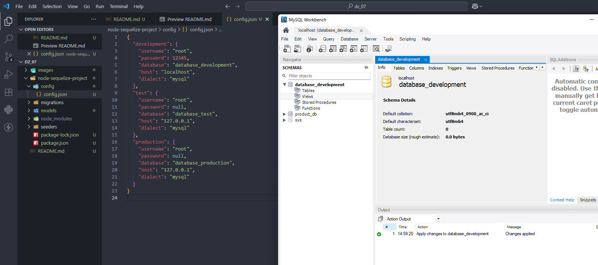
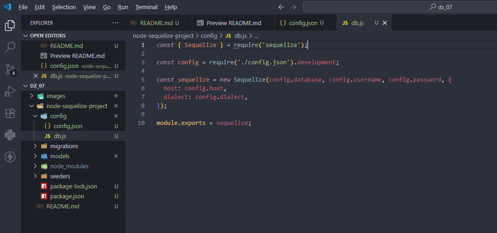
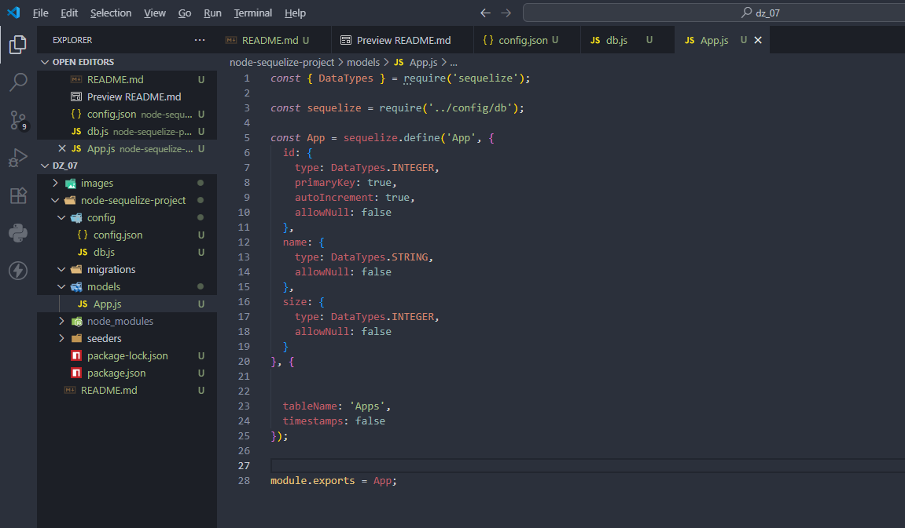
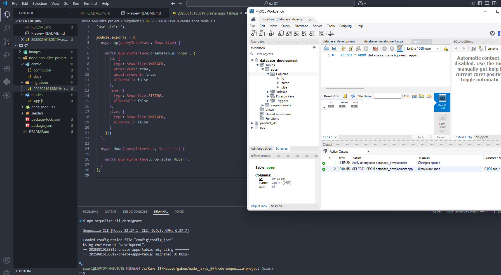

# Домашняя работа 7

### Задание 1. Создание и настройка проекта Node.js

1. Инициализация нового проекта:
- Откройте терминал и перейдите в директорию, где хотите создать новый проект.
- В терминале выполните команду `npm init -y`, чтобы инициализировать проект.

2. Установка зависимостей:
- Установите необходимые для работы с базой данных пакеты:
    - `sequelize` — ORM для взаимодействия с базой данных.
    - `sequelize-cli` — инструмент командной строки для управления миграциями и моделями.
    - `mysql2` — драйвер для работы с MySQL.
- Установите их, используя команду `npm install`.

3. Инициализация Sequelize в проекте:
- В терминале выполните команду `npx sequelize-cli init`. Эта команда создаст в проекте структуру папок и файлов, необходимых для работы с Sequelize.

---

---

### Задание 2. Настройка MySQL

1. Создание базы данных:
- Подключитесь к вашему MySQL серверу с помощью терминала или графического интерфейса MySQL Workbench.
- Создайте новую базу данных с именем `database_development`, которая будет использоваться для разработки вашего приложения.

2. Настройка конфигурационного файла `config.json`:
- Перейдите в директорию `config`, где уже должен находиться файл `config.json`, созданный в предыдущем задании.
- Откройте `config.json` и настройте параметры подключения к базе данных для среды разработки (development):
    - Укажите имя базы данных (`database_development`).
    - Укажите имя пользователя и пароль для доступа к базе данных.
    - Настройте параметры хоста (`localhost`) и диалекта (`mysql`).
    - Убедитесь, что эти параметры соответствуют вашему MySQL серверу.
    
---

---

### Задание 3. Настройка Sequelize в проекте

1. Создание файла `db.js`:
- В директории `config` создайте новый файл с именем `db.js`. Этот файл будет использоваться для настройки и подключения Sequelize к вашей базе данных.

2. Настройка подключения к базе данных:
- В файле `db.js` импортируйте необходимые модули - `sequelize` и конфигурационный файл.
- Создайте экземпляр Sequelize, используя параметры подключения из файла `config.json`. Убедитесь, что правильно указаны имя базы данных, пользователь, пароль и хост.
- Настройте экземпляр так, чтобы он был доступен для использования в других частях вашего приложения.

3. Экспорт экземпляра Sequelize:
- В конце файла `db.js` экспортируйте настроенный экземпляр Sequelize, чтобы его можно было использовать при создании моделей и работе с базой данных.

---

---

### Задание 4. Создание и настройка модели `App`

1. Создание файла модели:
- Перейдите в директорию `models` и создайте новый файл с именем `App.js`.
- В этом файле определите модель `App`, которая будет представлять данные в таблице базы данных. Укажите необходимые столбцы: `id`, `name`, и `size`.

2. Описание столбцов модели:
- В модели `App` определите следующие столбцы:
    - `id` — идентификатор, который будет автоматически увеличиваться для каждой новой записи и будет первичным ключом.
    - `name` — строка, представляющая имя приложения. Поле обязательно для заполнения.
    - `size` — число, представляющее вес приложения. Поле также обязательно для заполнения.

3. Дополнительные настройки модели:
- Настройте дополнительные параметры модели:
    - Явно укажите имя таблицы в базе данных (`Apps`).
    - Отключите автоматическое добавление полей `createdAt` и `updatedAt`, если они вам не нужны.

4. Экспорт модели:
- Экспортируйте модель `App`, чтобы она могла быть использована в других частях вашего приложения для взаимодействия с базой данных.

---

---

### Задание 5. Создание и настройка миграции для модели `App`

1. Генерация миграции:
- В терминале выполните команду для генерации новой миграции, которая будет создавать таблицу для модели `App`. Команда должна быть подобной `npx sequelize-cli migration:generate --name create-apps-table`.
- Эта команда создаст новый файл миграции в папке `migrations`.

2. Редактирование файла миграции:
- Перейдите в директорию `migrations` и найдите созданный файл миграции. Откройте его для редактирования.
- В секции `up` добавьте код для создания таблицы `Apps` в базе данных, с указанием всех столбцов (`id`, `name`, `size`) и их типов данных.
- В секции `down` добавьте код для удаления таблицы `Apps`, чтобы миграцию можно было откатить.

3. Применение миграции:
- После настройки файла миграции выполните команду `npx sequelize-cli db:migrate`, чтобы применить миграцию и создать таблицу `Apps` в базе данных.

4. Проверка результата:
- Перейдите в MySQL Workbench и проверьте, что таблица `Apps` действительно создалась.

---

