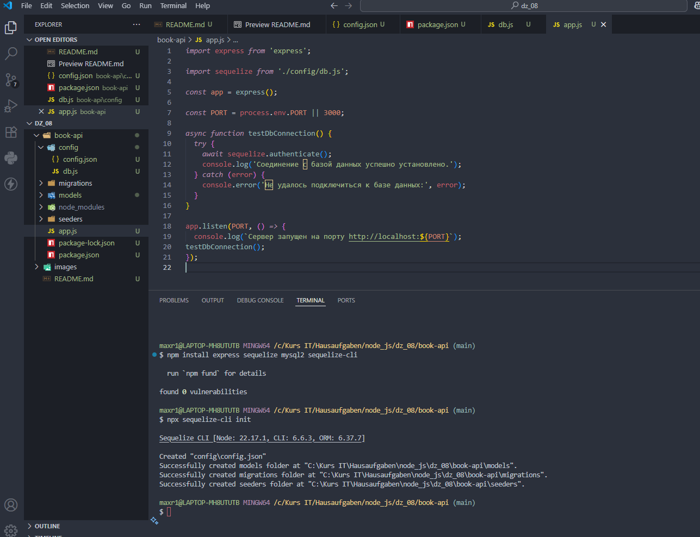
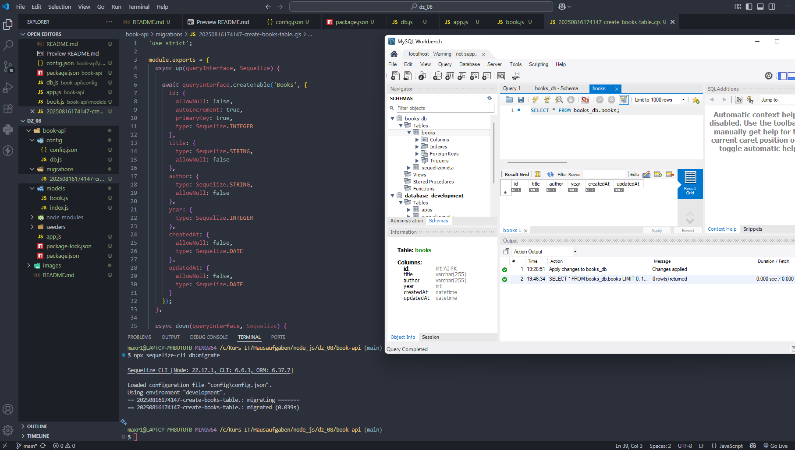
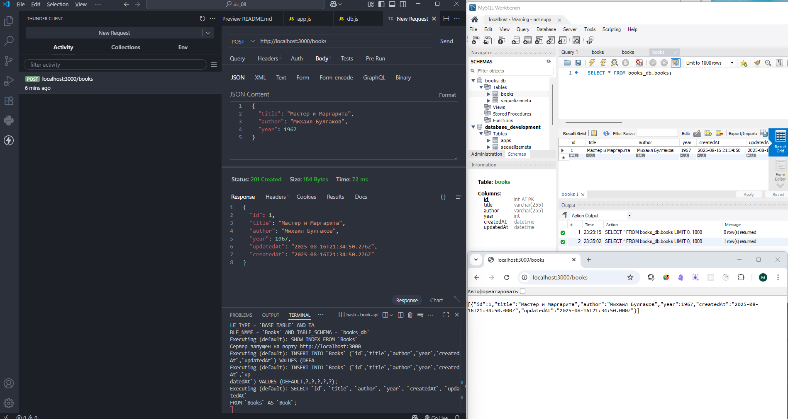
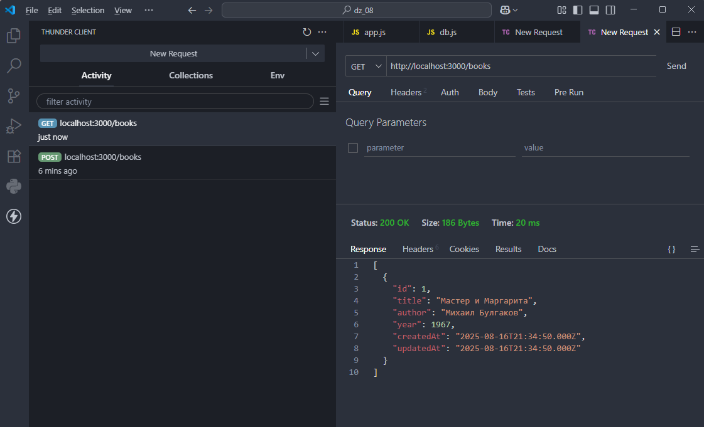
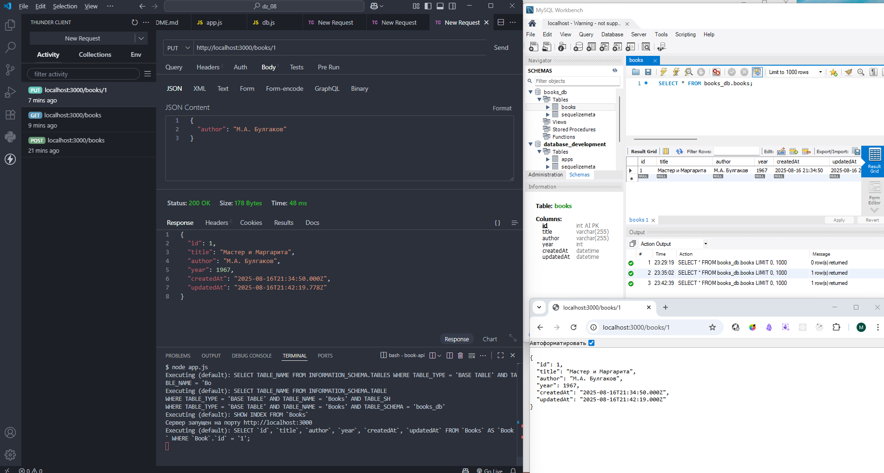
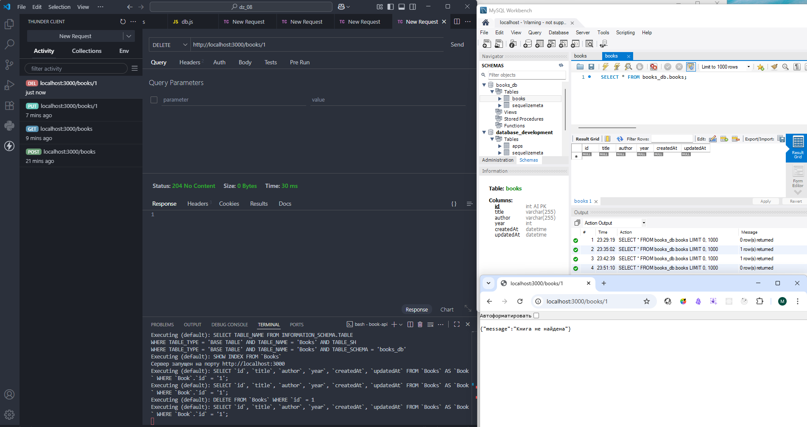

# Домашняя работа 8

### Задание 1. Создание и настройка нового проекта

1. Создайте новую директорию.
    
2. Откройте текстовый редактор, перейдите в только что созданную директорию.
    
3. Инициализируйте новый проект:
- `npm init -y`

4. Установите все необходимые для работы зависимости: Express, Sequelize, Sequelize CLI, MySQL2:
- `npm install express sequelize sequelize-cli mysql2`

5. При помощи Sequelize CLI создайте структуру проекта:
- `npx sequelize-cli init`

6. Настройте доступ подключение к базе данных:
- Настройте данные в файле `config.json`.

7. Настройка импортирования:
- Откройте файл package.json и добавьте в него: "type": "module", чтобы использовать import, а не require.

8. Создание файла для инициализации Sequelize (`db.js`):
- В папке config создайте файл `db.js`, в нём настройте подключение к базе данных, так же создайте объект sequelize.

9. Настройка Express-приложения:
- Настройте файл `app.js` для настройки и запуска Express-приложения.

---

---

### Задание 2. Создание и настройка модели и ее миграции

1. Создание новой модели
- Создайте файл модели `book.js` в директории models.

2. Настройте модель Book
- Откройте файл модели, который был создан в папке `models`.
- Настройте все атрибуты модели - `title`, `author`, `year`.
- Убедитесь, что модель экспортируется корректно.

3. Настройка миграции для модели
- Откройте терминал, создайте миграцию для модели при помощи команды: `npx sequelize-cli migration:generate --name create-books-table`.
- Откройте файл миграции и настройте инструкции для создания таблицы `Books` с нужными колонками - `title`, `author`, `year`.

4. Выполнение миграции
- В терминале выполните команду `npx sequelize-cli db:migrate`.
- Эта команда выполнит все миграции, которые ещё не были применены, и создаст таблицу `Books` в базе данных.

5. Проверьте результат миграции
- Откройте MySQL Workbench и подключитесь к вашей базе данных.
- Убедитесь, что таблица `Books` была успешно создана с нужными колонками.
    
---

---

### Задание 3. 

1. Настройте маршрут для получения списка всех книг:
- В директории вашего проекта найдите и откройте файл `app.js`.
- В файле `app.js` добавьте обработчик GET маршрута для пути `/books`.
- Внутри обработчика используйте метод `findAll()` модели `Book` для получения всех записей из таблицы `Books`.
- Отправьте полученные данные обратно в виде JSON-ответа.

2. Настройка POST маршрута для создания записи
- В файле `app.js` добавьте обработчик POST маршрута для пути `/books`.
- Внутри обработчика используйте метод `create()` модели `Book`, чтобы создать новую запись в базе данных на основе данных, переданных в теле запроса.

3. Настройте парсинг JSON данных:
- Убедитесь, что Express-приложение настроено для работы с JSON данными. Для этого добавьте middleware `express.json()` в `app.js`, если он ещё не добавлен.

4. Настройка PUT маршрута для обновления записи
- В файле `app.js` добавьте обработчик PUT маршрута для пути `/books/:id`, где `:id` — это параметр пути, представляющий идентификатор книги.
- Используйте метод `update()` модели `Book`, чтобы обновить данные книги с указанным идентификатором.

5. Настройка DELETE маршрута для удаления записи
- В файле `app.js` добавьте обработчик DELETE маршрута для пути `/books/:id`.
- Используйте метод `destroy()` модели `Book`, чтобы удалить запись книги с указанным идентификатором из базы данных.

6. Тестирование маршрутов
- Запустите ваше Express-приложение, используя команду `node app.js` в терминале.
- Отправьте POST запрос на маршрут `/books` с телом запроса, содержащим данные о новой книге (`title`, `author`, `year`).
- Убедитесь, что запись успешно создается в базе данных.
- Отправьте GET запрос на маршрут `/books`.
- Убедитесь, что в ответе возвращается список всех книг, которые находятся в базе данных.
- Отправьте PUT запрос на маршрут `/books/:id`, передав идентификатор книги и новые данные для обновления.
- Убедитесь, что запись успешно обновляется.
- Отправьте DELETE запрос на маршрут `/books/:id`, передав идентификатор книги для удаления.
- Убедитесь, что запись успешно удаляется из базы данных.

---

Создание новой книги (POST)

---

Получение списка всех книг (GET)

---

Обновление существующей книги (PUT)

---

Удаление книги (DELETE)

