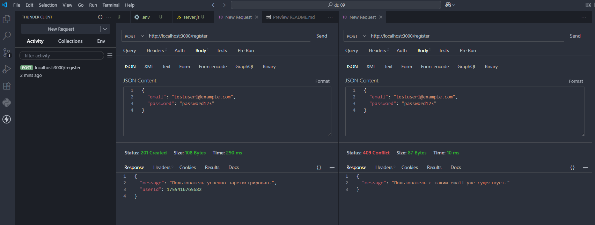
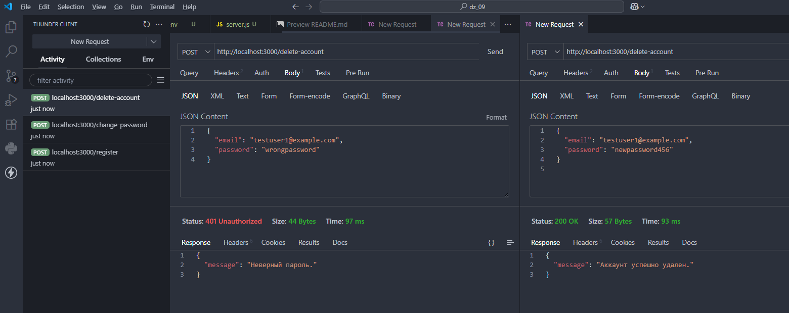

# Домашняя работа 9

### Задание 1. Реализация проверки уникальности email при регистрации

1. Создание маршрута регистрации:
- Создайте маршрут `POST /register`, который будет принимать данные пользователя, включая email и пароль.

2. Проверка уникальности email:
- В этом маршруте перед регистрацией пользователя проверьте, существует ли уже в базе данных пользователь с таким email.

3. Возврат ошибки при повторном email:
- Если такой email уже существует, верните ошибку, сообщив пользователю, что email уже зарегистрирован.

4. Регистрация нового пользователя:
- Если email уникален, продолжайте регистрацию, хэшируя пароль с помощью `bcrypt`.

---

---

### Задание 2. Реализация принудительного обновления пароля

1. Добавление поля для проверки необходимости смены пароля:
- В модель пользователя добавьте поле `mustChangePassword` (булевое значение), которое будет указывать, должен ли пользователь сменить пароль при следующем входе.

2. Создание middleware для проверки необходимости смены пароля:
- Создайте middleware, которое будет проверять значение `mustChangePassword` при каждом входе пользователя. Если это значение равно `true`, перенаправляйте пользователя на страницу смены пароля.

3. Создание маршрута для смены пароля:
= Создайте маршрут `POST /change-password`, который будет принимать новый пароль и обновлять его в базе данных, предварительно хэшируя с помощью `bcrypt`. После успешной смены пароля установите `mustChangePassword` в `false`.
    
---

---

### Задание 3. Реализация функции удаления аккаунта

1. Создание маршрута для удаления аккаунта:
- Создайте маршрут `POST /delete-account`, который будет доступен только авторизованным пользователям.

2. Подтверждение пароля перед удалением аккаунта:
- В этом маршруте попросите пользователя ввести текущий пароль. Проверьте введенный пароль с помощью `bcrypt.compare`.

3. Удаление аккаунта:
- Если пароль подтвержден, удалите учетную запись пользователя из базы данных. Если пароль неверен, верните ошибку.

---

---

### Задание 4. Ограничение доступа к маршрутам на основе роли

1. Добавление роли пользователю:
- В модель пользователя добавьте поле `role`, которое может быть, например, `user` или `admin`.

2. Создание маршрутов для администраторов:
- Создайте маршрут `GET /admin`, который должен быть доступен только пользователям с ролью `admin`.

3. Проверка роли пользователя:
- Создайте middleware, которое будет проверять роль пользователя перед доступом к маршруту. Если роль не соответствует `admin`, возвращайте ошибку доступа.

---

---

### Задание 5. Реализация функции изменения email

1. Создание маршрута для изменения email:
- Создайте маршрут `POST /change-email`, который будет принимать новый email и текущий пароль.

2. Проверка пароля перед изменением email:
- В этом маршруте запросите у пользователя текущий пароль и сравните его с сохраненным в базе данных с помощью `bcrypt.compare`.

3. Обновление email:
- Если пароль введен верно, обновите email пользователя в базе данных, предварительно проверив его уникальность. Если пароль неверен, верните ошибку.

---

