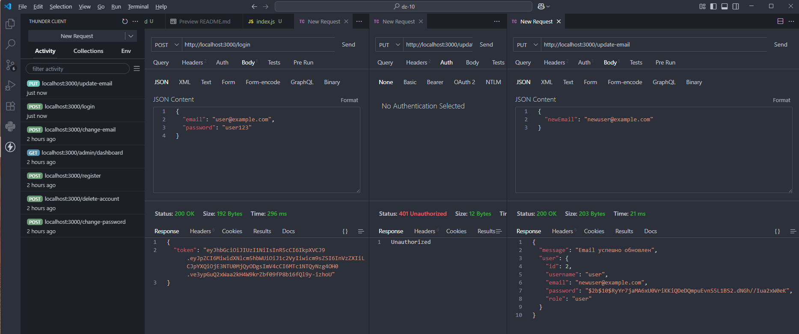
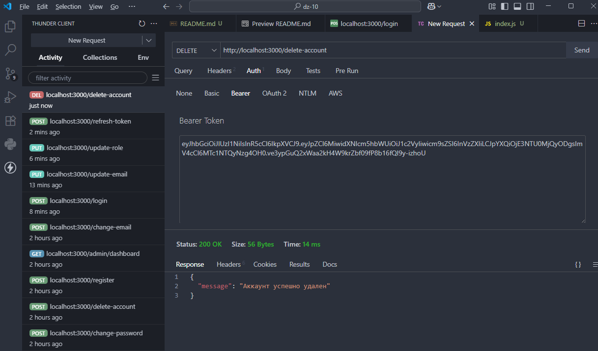
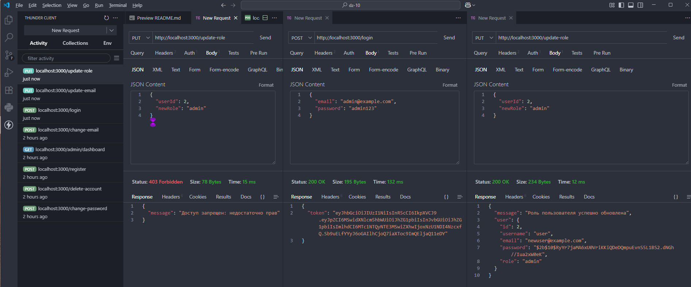
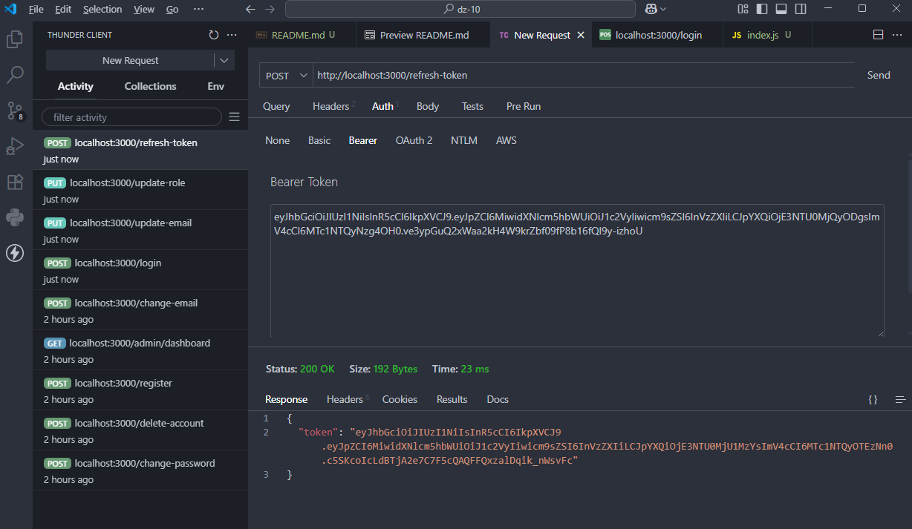

# Домашняя работа 10

### Задание 1. Реализация маршрута для обновления email пользователя

1. Инициализация проекта:
- Создайте новую папку для проекта и откройте её в терминале.
- Выполните команду `npm init -y`, чтобы инициализировать новый проект.
- Установите необходимые зависимости: `npm install express bcrypt jsonwebtoken`.
- Создайте файл `index.js` и настройте простейший сервер с использованием Express.

2. Настройка базовой структуры:
    
- Создайте массив, который будет симулировать базу данных пользователей с полями `id`, `username`, `email`, и `password`.
- Реализуйте базовую аутентификацию с помощью JWT, если ее еще нет. Убедитесь, что у вас есть маршрут для входа (логина) и генерации токена.

3. Создание маршрута для обновления email:
- Создайте маршрут `/update-email`, который будет защищен с помощью JWT. Добавьте middleware для проверки токена (например, `authenticateJWT`).
- В этом маршруте обработайте POST или PUT запросы, где пользователь будет передавать новый email в теле запроса.
- Найдите пользователя в массиве на основе `id` из токена и обновите его email.

4. Обработка ошибок и успешного обновления:
- Если пользователь найден и email успешно обновлён, верните ответ с обновленными данными.
- Если пользователь не найден или произошла ошибка, верните соответствующее сообщение об ошибке.

5. Тестирование маршрута:
- Проверьте, что обновление email работает корректно, и что неавторизованные запросы блокируются.

---

---

### Задание 2. Реализация маршрута для удаления аккаунта пользователя

1. Инициализация проекта

2. Создание структуры для симуляции базы данных:
- Добавьте массив с пользователями, включающий `id`, `username`, `email`, и `password`.
- Убедитесь, что у вас есть реализация JWT для проверки авторизации.

3. Создание маршрута для удаления аккаунта:
- Создайте маршрут `/delete-account`, который будет защищён с помощью JWT.
- Реализуйте middleware для проверки токена, чтобы убедиться, что пользователь авторизован.

4. Удаление пользователя:
- Внутри этого маршрута получите данные пользователя из токена и найдите его в массиве.
- Удалите его запись из массива с помощью метода, например `filter`.
- Верните пользователю сообщение о том, что его аккаунт успешно удалён.

5. Обработка ошибок:
- Если пользователя не удалось найти или произошла ошибка, верните сообщение об ошибке.
- Проверьте, что маршрут недоступен для неавторизованных пользователей.

6. Тестирование:
- Проверьте, что маршрут работает корректно и аккаунты действительно удаляются.
    
---
Пользователь с `id: 2` был удален после проведения тестирования заданий 3 и 4.

---

### Задание 3. Реализация маршрута для обновления роли пользователя

1. Инициализация проекта  

2. Настройка базы данных и JWT:
- Добавьте массив пользователей, включающий `id`, `username`, `email`, `password`, и `role`.
- Реализуйте middleware для проверки JWT, чтобы убедиться, что пользователь авторизован.

3. Создание маршрута для обновления роли:
- Создайте маршрут `/update-role`, который будет доступен только администраторам.
- Используйте middleware для проверки роли пользователя (например, `authorizeRole`), чтобы ограничить доступ к этому маршруту только администраторам.

4. Обновление роли пользователя:
- В теле запроса передавайте ID пользователя и новую роль.
- Найдите этого пользователя в массиве на основе ID и обновите его роль.

5. Обработка ошибок и успешного выполнения:
- Если роль успешно обновлена, верните сообщение об успешном выполнении операции.
- Если произошла ошибка (например, пользователь не найден), верните сообщение об ошибке.

6. Тестирование маршрута:
- Проверьте, что маршрут работает корректно и доступен только администраторам.

---

---

### Задание 4. Реализация механизма обновления JWT токена

1. Инициализация проекта

2. Создание базы данных и JWT функционала:
- Добавьте массив с пользователями и настройте JWT для аутентификации.
- Убедитесь, что у вас есть маршруты для логина и генерации токенов.

3. Создание маршрута для обновления токена:
- Создайте новый маршрут `/refresh-token`, который будет защищен JWT.
- Внутри этого маршрута извлеките текущий токен пользователя из заголовка запроса.

4. Проверка токена и создание нового:
- Проверьте, что токен валиден. Если токен просрочен, верните ошибку.
- Если токен действителен, создайте новый JWT токен для пользователя и верните его в ответе.

5. Обработка ошибок:
- Если токен неверен или отсутствует, верните сообщение об ошибке.
- Убедитесь, что маршруты корректно реагируют на обновленный токен.

6. Тестирование механизма:
- Проверьте, что с новым токеном можно обращаться к защищенным маршрутам и что сессия корректно продлевается.
---

