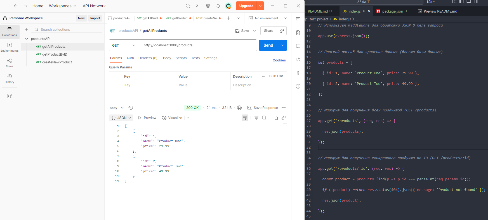
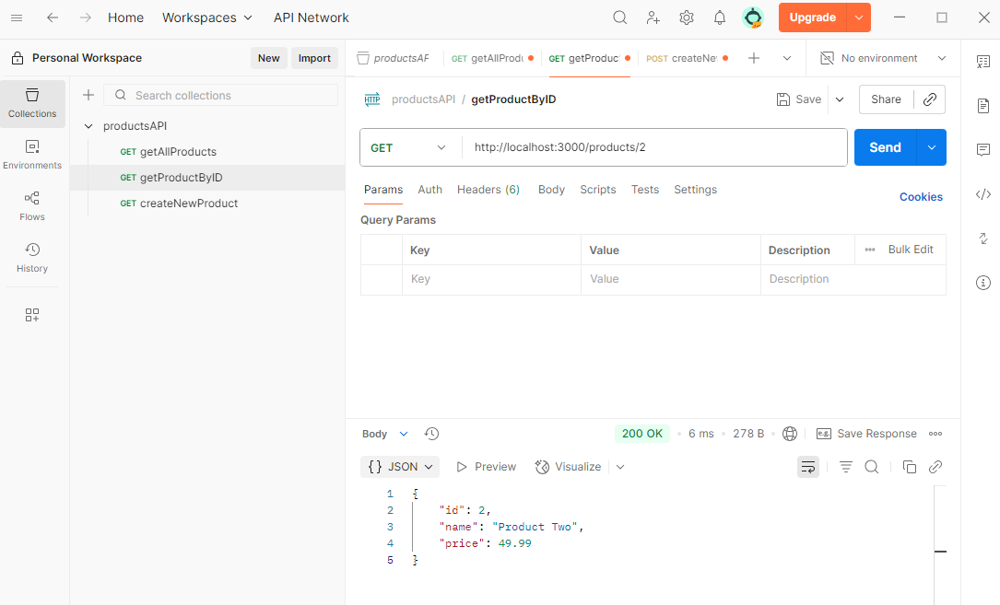
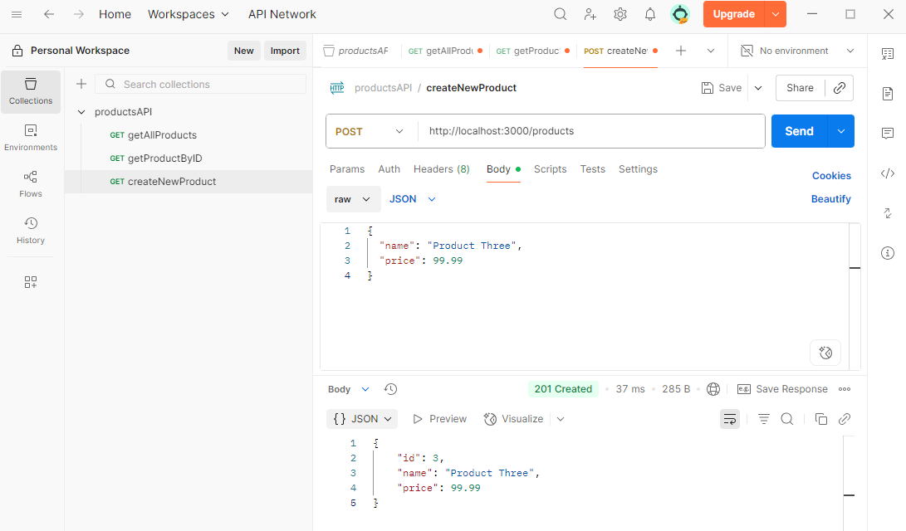
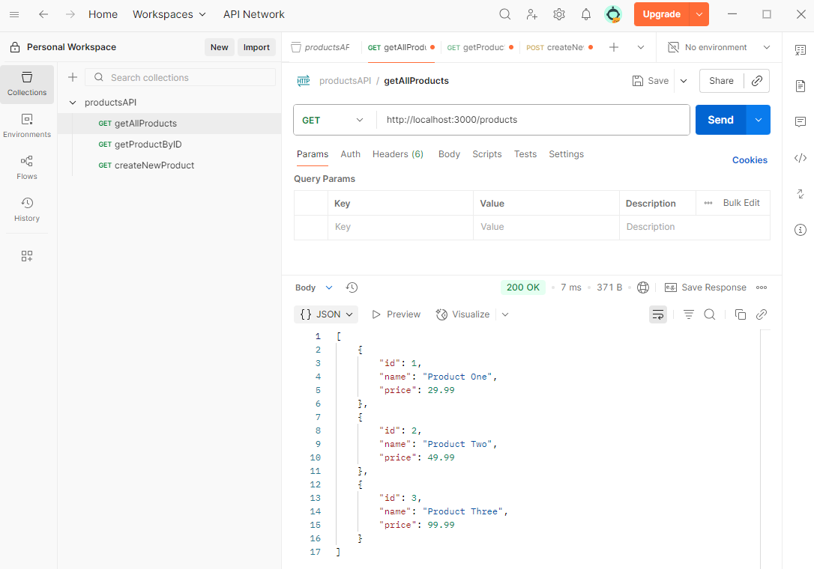

# Домашняя работа 11

### Задание 1. Тестирование API

1. Запустите API
- Скачайте или скопируйте готовый код API и сохраните его в файле, например, `index.js`.
- Откройте терминал и перейдите в директорию, где находится этот файл.
- Запустите сервер, убедитесь, что сервер запущен и слушает на порту 3000.

2. Протестируйте маршруты с помощью Postman
- Откройте Postman и создайте новый запрос для каждого из маршрутов API:
    - GET /products: Этот запрос вернет список всех продуктов.
    - GET /products/:id: Этот запрос вернет конкретный продукт по его ID (например, `/products/1`).
    - POST /products: Этот запрос добавляет новый продукт. В теле запроса необходимо передать JSON с полями `name` и `price`.

3. Объедините запросы в коллекцию
- Создайте новую коллекцию в Postman:
    - На панели слева выберите "Collections".
    - Нажмите на "New Collection" и дайте коллекции название (например, "Products API").

- Добавьте все запросы в коллекцию:
    - Откройте каждый созданный запрос.
    - Нажмите на значок "Save" и выберите вашу коллекцию для сохранения.

4. Проверьте коллекцию и убедитесь в корректности работы запросов
- Откройте каждый запрос в вашей коллекции и отправьте его.
    - Убедитесь, что запросы возвращают ожидаемые результаты.
    - Проверьте правильность получения, создания и отображения данных.

---
Запрос GET /products (Получение всех продуктов)

---
Запрос GET /products/:id (Получение одного продукта)

---
Запрос POST /products (Создание нового продукта)

---
Запрос GET /products (Получение всех продуктов)

