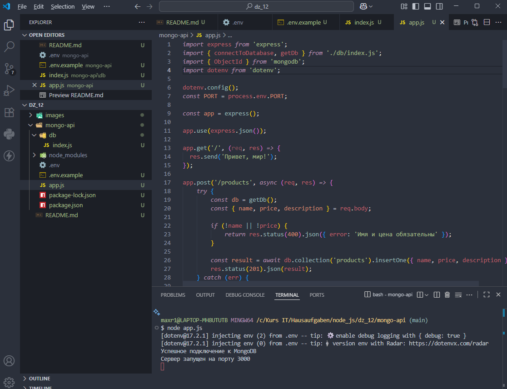
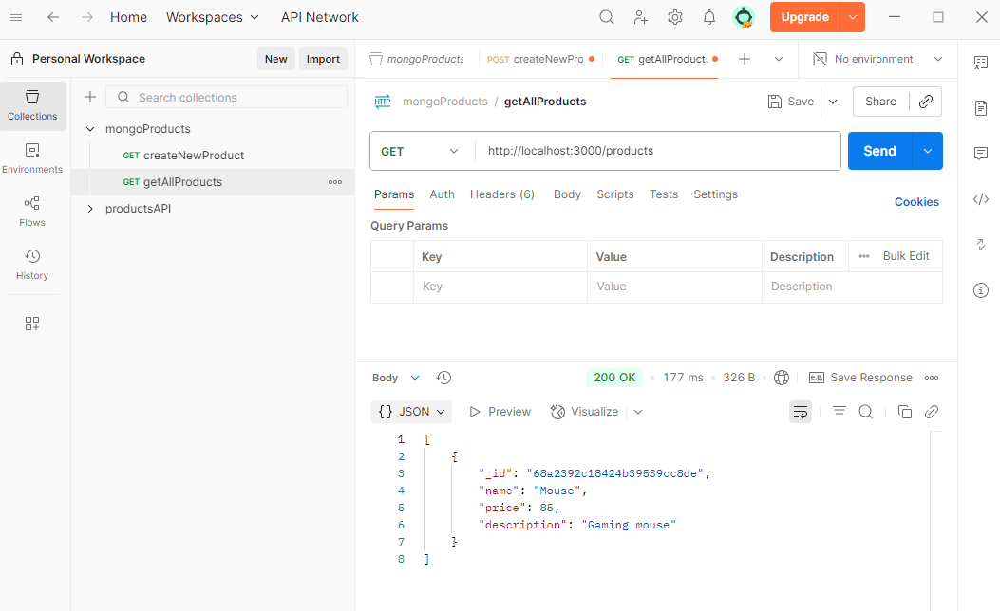
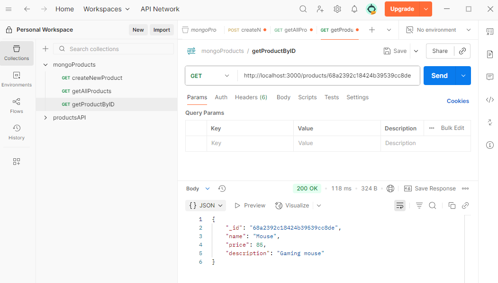
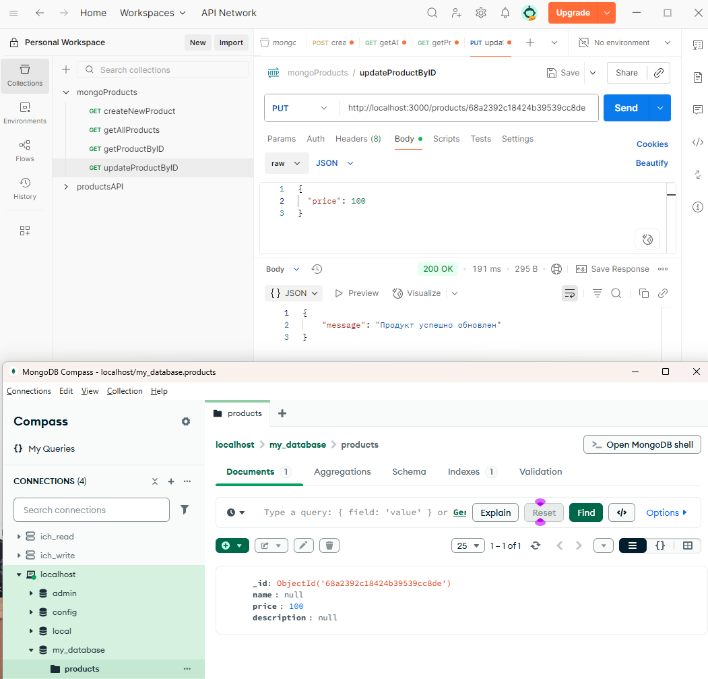
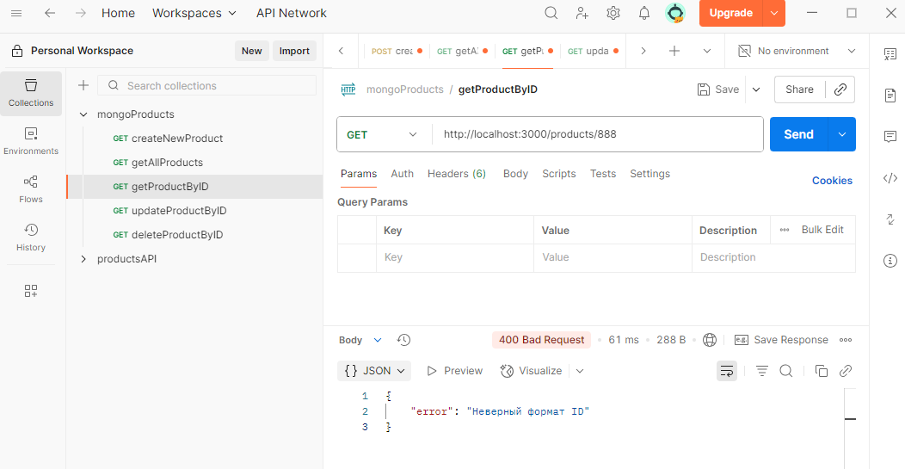
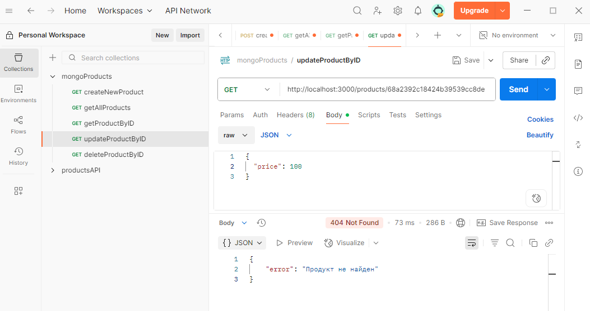

# Домашняя работа 12

### Задание 1. Создание нового проекта с подключением к MongoDB

1. Создайте новый проект Node.js
- Инициализируйте проект командой `npm init -y`, которая создаст файл `package.json` с основными настройками проекта.

2. Установите необходимые пакеты:
- Установите необходимые зависимости для проекта: Express для создания сервера, MongoDB Driver для работы с базой данных, и dotenv для использования переменных окружения. Сделайте это с помощью команды `npm install`.

3. Создайте структуру проекта:
- Создайте папку `db` для хранения файлов, связанных с базой данных.
- Внутри папки `db` создайте файл `index.js`, который будет отвечать за подключение к MongoDB.
- В корне проекта создайте файл `app.js`, который будет основным файлом вашего приложения.
- Также создайте файл `.env` для хранения конфиденциальной информации, такой как строка подключения к базе данных.

4. Настройте подключение к MongoDB:
- В файле `.env` укажите строку подключения к вашей локальной базе данных MongoDB. В файле `db/index.js` реализуйте подключение к базе данных, используя данные из `.env`.

5. Настройте приложение Express:
- В файле `app.js` настройте сервер Express и подключение к базе данных, чтобы сервер запускался только при успешном соединении с базой данных.

6. Проверьте подключение:
- Запустите приложение через команду `node app.js` и убедитесь, что соединение с базой данных установлено успешно и сервер работает.

---

---

### Задание 2. Создание API для управления другой коллекцией

1. Создайте новую коллекцию в MongoDB:
- Используя MongoDB Compass, создайте новую коллекцию в базе данных - коллекцию `products`.
- Определите структуру данных для этой коллекции - поля `name`, `price`, и `description`.

2. Создайте API маршруты для управления коллекцией:
- В файле `app.js` создайте маршруты для выполнения CRUD операций с коллекцией `products`.
    - Настройте маршрут `POST /products` для создания нового продукта.
    - Настройте маршрут `GET /products` для получения списка всех продуктов.
    - Настройте маршрут `GET /products/:id` для получения конкретного продукта по ID.
    - Настройте маршрут `PUT /products/:id` для обновления информации о продукте.
    - Настройте маршрут `DELETE /products/:id` для удаления продукта.

3. Используйте MongoDB Driver для взаимодействия с базой данных:
- В каждом из маршрутов реализуйте логику для работы с базой данных, используя MongoDB Driver.
- Убедитесь, что ваши запросы и ответы возвращают корректные данные и статусы.

4. Проверьте работоспособность:
- Запустите приложение и с помощью Postman протестируйте все созданные маршруты. Убедитесь, что все операции выполняются корректно.

---
Создание продукта (POST /products) 

---
Получение списка всех продуктов (GET /products) 

---
Получение одного продукта по ID (GET /products/:id) 

---
Обновление продукта (PUT /products/:id) 

---
 Удаление продукта (DELETE /products/:id) 

---

### Задание 3. Обработка ошибок

1. Реализуйте обработку ошибок с помощью `try-catch`:
- В асинхронных функциях для работы с базой данных используйте блоки `try-catch`, чтобы перехватывать и обрабатывать ошибки.
- В случае ошибки отправьте клиенту ответ с кодом 500 и описанием ошибки.

2. Проверьте обработку ошибок:
- Создайте несколько ситуаций, где могут возникнуть ошибки (например, отправка некорректных данных), и убедитесь, что ошибки правильно обрабатываются и клиент получает соответствующие сообщения.

---

---

