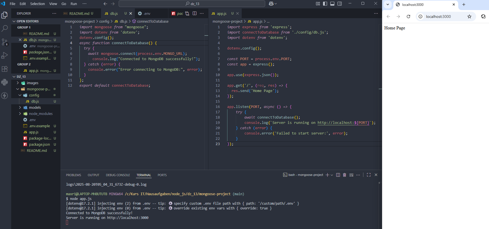
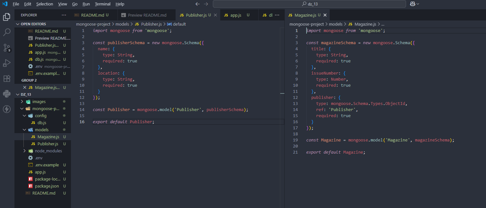
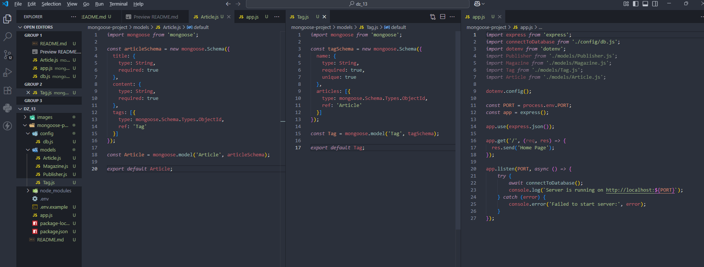

# Домашняя работа 13

### Задание 1. Инициализация проекта, настройка подключения к базе данных MongoDB

1. Инициализация нового проекта
- Инициализируйте новый проект в удобной вам директории.
- Установите необходимые зависимости: express, dotenv.
- Подготовьте структуру файлов и папок.
- Настройте простой Express сервер.

2. Установка Mongoose
- Запустите терминал или командную строку в корневой папке вашего проекта Express.
- В терминале введите следующую команду для установки Mongoose:
`npm install mongoose`

3. Подключение Mongoose к вашему проекту
- Откройте файл, в котором настроен ваш Express сервер.
- В верхней части файла, где вы импортируете необходимые модули, добавьте код для подключения Mongoose.

4. Настройка подключения к MongoDB
- Определите строку подключения к вашей базе данных MongoDB.

5. Управление подключением
- Настройте Mongoose для обработки подключения к базе данных. Убедитесь, что вы добавили обработку успешного подключения и возможных ошибок.

6. Тестирование подключения
- Вновь откройте терминал в корне вашего проекта и запустите Express сервер.
- Если подключение к базе данных настроено правильно, вы увидите сообщение о успешном подключении к MongoDB в консоли.

---

---

### Задание 2. Создать связь "один ко многим" между моделями `Publisher` и `Magazine`.

1. Определение модели издателя
- Создайте новую схему `Publisher`, которая будет содержать поля, такие как `name` (название издателя) и `location` (местоположение издателя).
- Создайте модель `Publisher`, используя схему `Publisher`.

2. Определение модели журнала
- Создайте новую схему `Magazine`, которая будет содержать поля, такие как `title` (название журнала) и `issueNumber` (номер выпуска).
- Добавьте поле `publisher`, которое будет содержать ссылку на модель `Publisher`, к которой относится журнал.
- Создайте модель `Magazine`, используя схему `Magazine`.

3. Экспорт и использование моделей
- Убедитесь, что обе модели экспортированы и доступны для использования в других частях приложения.

---

---

### Задание 3. Создать связь "многие ко многим" между моделями `Tag` и `Article`

1. Определение модели тега
- Создайте новую схему `Tag`, которая будет содержать поле `name` (название тега).
- Добавьте поле `articles`, которое будет массивом ссылок на статьи (`Article`).
- Создайте модель `Tag`, используя схему `Tag`.

2. Определение модели статьи
- Создайте новую схему `Article`, которая будет содержать поля, такие как `title` (заголовок статьи) и `content` (содержимое статьи).
- Добавьте поле `tags`, которое будет массивом ссылок на теги (`Tag`).
- Создайте модель `Article`, используя схему `Article`.

3. Экспорт и использование моделей
- Убедитесь, что обе модели экспортированы и доступны для использования в других частях приложения.

---

---

