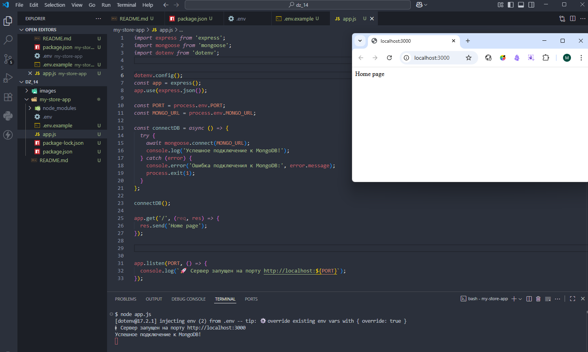
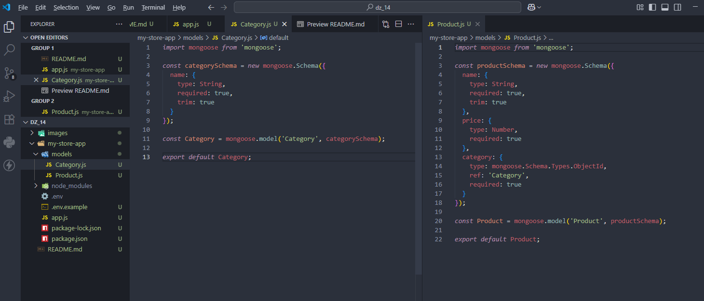
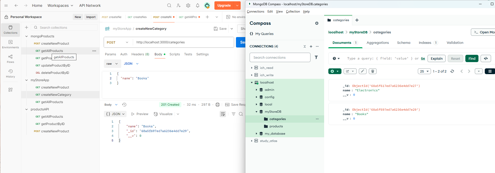
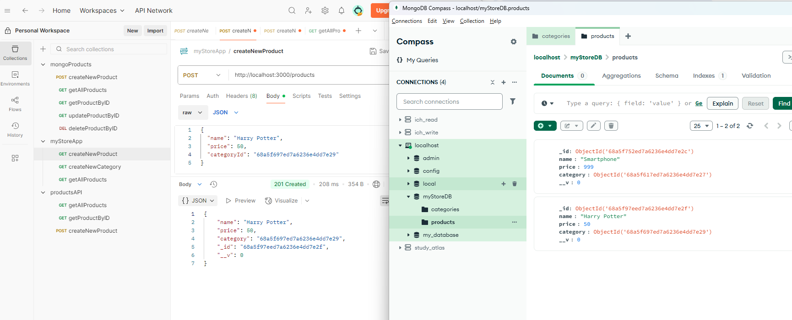
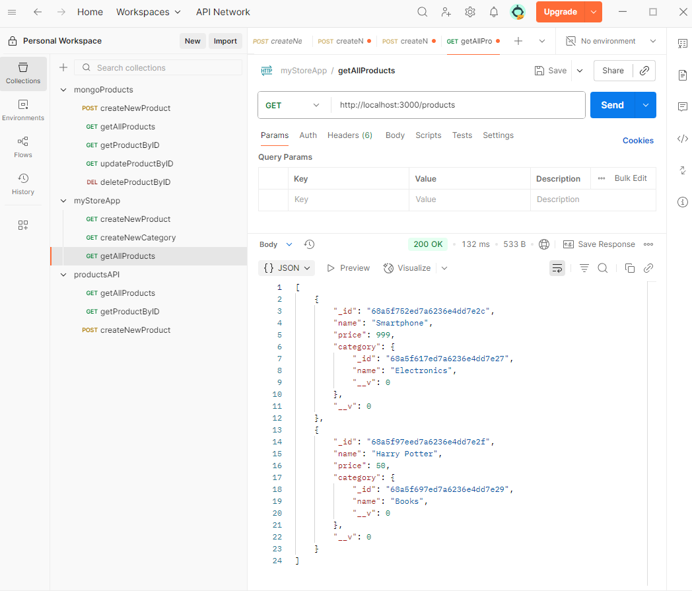

# Домашняя работа 14

### Задание 1. Создание и настройка проекта

1. Инициализация нового проекта
- Откройте терминал и перейдите в папку, где вы хотите создать проект.
- Введите команду `npm init -y`, чтобы создать файл `package.json` с настройками вашего проекта.

2. Установка необходимых зависимостей
- Установите Express, Mongoose, dotenv

3. Создание файла `app.js` для запуска Express-сервера
- Создайте в корневой папке проекта файл с именем `app.js`.
- В этом файле настройте ваш Express-сервер.
- Вам нужно создать основной сервер Express и настроить его на прослушивание порта 3000.

4. Настройка подключения к базе данных MongoDB
- Создайте файл `.env` в корневой папке вашего проекта. Этот файл будет использоваться для хранения конфиденциальных данных, таких как URL для подключения к MongoDB.
- Внутри файла `.env` добавьте строку с переменной, которая будет хранить URL вашей базы данных MongoDB. 
- В файле `app.js` используйте библиотеку `dotenv`, чтобы загрузить переменные окружения из файла `.env`. Это позволит вашему приложению подключаться к базе данных, используя защищенный URL.
- Настройте Mongoose для подключения к MongoDB с использованием переменной из файла `.env`. Убедитесь, что вы добавили код для обработки ошибок подключения.

5. Запуск сервера и проверка подключения
- Убедитесь, что сервер успешно запущен и подключение к базе данных установлено. Если вы видите сообщения об успешном подключении в терминале, значит все настроено правильно.

---

---

### Задание 2. Создание двух моделей и настройка связи один ко многим

1. Создание модели Category
- В папке `models` создайте файл `Category.js`.
- Определите схему для категории (Category) с полем `name` (строка, обязательное поле).
- Создайте модель на основе схемы и экспортируйте её.

2. Создание модели Product
- В папке `models` создайте файл `Product.js`.
- Определите схему для продукта (Product) с полями `name` (строка, обязательное поле), `price` (число, обязательное поле), и `category` (ссылка на модель `Category`, используя `type: mongoose.Schema.Types.ObjectId` и `ref: 'Category'`).
- Создайте модель на основе схемы и экспортируйте её.
---

---

### Задание 3. Добавление документов в коллекции и использование populate

1. Добавление категорий
- В файле `app.js` создайте маршрут `POST /categories`, который будет добавлять новые категории в базу данных, используя модель `Category`.
- Добавьте пару категорий, например, "Electronics" и "Books".

2. Добавление продуктов
- Создайте маршрут `POST /products`, который будет добавлять новые продукты в базу данных, используя модель `Product`. При добавлении продукта укажите `category` как ObjectId одной из созданных категорий.
- Добавьте пару продуктов, например, телефон (в категорию "Electronics") и книгу (в категорию "Books").

3. Использование populate
- Создайте маршрут `GET /products`, который будет возвращать список всех продуктов с популированными данными о категориях, используя метод `populate('category')`.
- Проверьте, что запрос возвращает продукты с полной информацией о связанных категориях. 

---
Добавление категории

---
Добавление продукта

---
Получение списка продуктов

