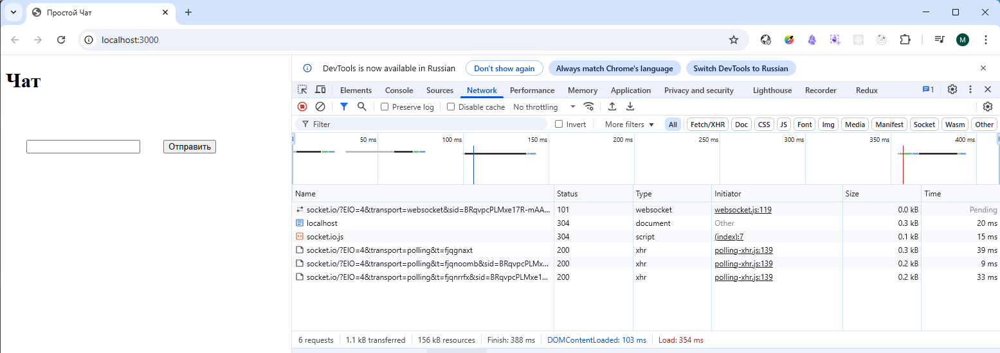

# Домашняя работа 15

### Задание 1. Реализация простого чата с использованием Express и Socket.io

1. Создание проекта и установка зависимостей:
- Создайте новую папку для вашего проекта и перейдите в нее через терминал или командную строку.
- Инициализируйте новый проект с помощью команды `npm init -y`.
- Установите необходимые зависимости: Express и Socket.io. Для этого выполните команду: npm install express socket.io

2. Настройка серверной части:
- Создайте файл `app.js` в корне вашего проекта. Этот файл будет содержать код для запуска сервера.
- В этом файле вам нужно создать сервер на основе Express и настроить Socket.io для обработки WebSocket-соединений.
- Настройте Express для обслуживания статических файлов из папки `public`. Это необходимо для того, чтобы ваш HTML-файл и связанные с ним ресурсы были доступны клиентам.
- Реализуйте обработку событий подключения (`connection`) и отключения (`disconnect`) пользователей. При подключении нового пользователя, выведите сообщение в консоль.
- Добавьте обработку пользовательских сообщений. Когда клиент отправляет сообщение, сервер должен получить его, отобразить в консоли и отправить обратно клиенту подтверждение о получении.

3. Создание папки для статических файлов:
- В корне вашего проекта создайте папку `public`. Все статические файлы, такие как HTML, CSS и клиентские JavaScript, будут находиться в этой папке.

4. Создание HTML-страницы:
- В папке `public` создайте файл `index.html`. Это будет основная страница вашего чата.
- В HTML-файле создайте простую структуру страницы, которая включает заголовок, поле для ввода сообщений, кнопку для отправки и область для отображения полученных сообщений.
- Подключите клиентскую библиотеку Socket.io на странице, чтобы обеспечить взаимодействие с сервером через WebSocket.

5. Настройка клиентской части (JavaScript на стороне клиента):
- Внутри вашего HTML-файла добавьте JavaScript-код, который будет инициализировать соединение с сервером через Socket.io.
- Реализуйте обработчик нажатия кнопки "Send Message". Когда пользователь нажимает кнопку, текст из поля ввода должен отправляться на сервер как сообщение.
- Настройте обработку ответа от сервера. Когда сервер отправляет подтверждение о получении сообщения, оно должно отображаться в специальной области на странице.

6. Запуск и тестирование приложения:
- Запустите ваш сервер с помощью команды `node app.js`.
- Откройте браузер и перейдите по адресу `http://localhost:3000/`, чтобы загрузить вашу HTML-страницу.
- Проверьте, что при отправке сообщения с клиента, оно появляется в консоли сервера, а на клиентской стороне отображается подтверждение от сервера.
- Откройте Devtools в браузере (F12), проанализируйте сетевые запросы во вкладке Network.

---

---

