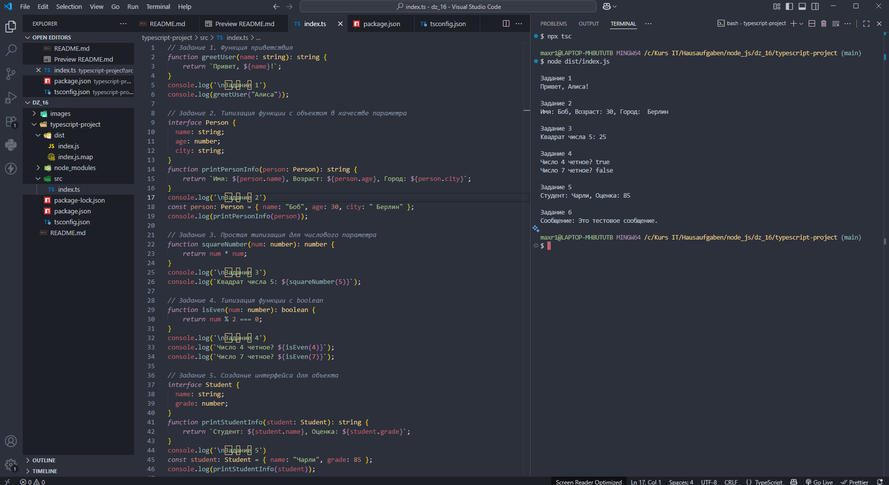

# Домашняя работа 16

### Задание 1. Функция приветствия

1. Напишите функцию `greetUser`, которая принимает имя пользователя (строка) и выводит приветственное сообщение в консоль: `"Привет, <name>!"`. Используйте строгую типизацию.

### Задание 2. Типизация функции с объектом в качестве параметра

1. Создайте интерфейс `Person`, который описывает человека с полями `name`, `age`, и `city`.

2. Напишите функцию `printPersonInfo`, которая принимает объект типа `Person` и выводит информацию о человеке в формате: `"Имя: <name>, Возраст: <age>, Город: <city>"`.
    
### Задание 3. Простая типизация для числового параметра

1. Напишите функцию `squareNumber`, которая принимает число и возвращает его квадрат. Используйте строгую типизацию.
   
### Задание 4. Типизация функции с boolean

1. Напишите функцию `isEven`, которая принимает число и возвращает `true`, если число четное, и `false`, если нечетное. Используйте строгую типизацию.

### Задание 5. Создание интерфейса для объекта

1. Создайте интерфейс `Student`, который описывает студента с полями `name` (строка) и `grade` (число).
    
2. Напишите функцию `printStudentInfo`, которая принимает объект типа `Student` и выводит информацию о студенте в формате: `"Студент: <name>, Оценка: <grade>"`.
    
### Задание 6. Функция с типом `void`
  
1. Напишите функцию `logMessage`, которая принимает строку и выводит её в консоль без возвращаемого значения. Используйте тип `void`.

---

---

