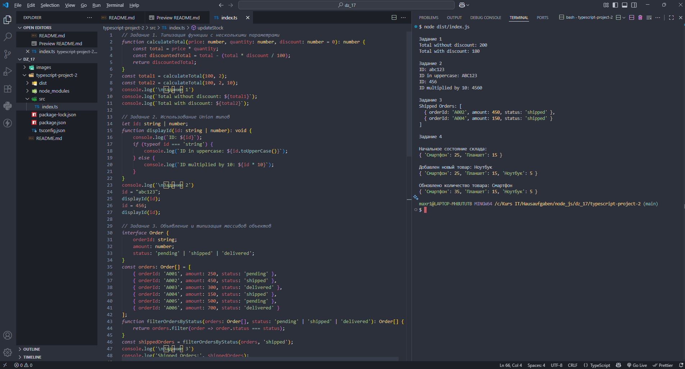

# Домашняя работа 17

### Задание 1. Типизация функции с несколькими параметрами

1. Напишите функцию `calculateTotal`, которая принимает три параметра:  
   - `price` (число)  
   - `quantity` (число)  
   - `discount` (число, по умолчанию равен 0)

2. Функция должна возвращать общую стоимость товаров с учетом скидки. Если скидка не указана, она считается равной нулю.

### Задание 2. Использование Union типов

1. Создайте переменную `id`, которая может быть либо строкой, либо числом.  

2. Напишите функцию `displayId`, которая принимает эту переменную и выводит сообщение, содержащее значение ID. Если `id` — строка, выведите её в верхнем регистре. Если `id` — число, умножьте его на 10 перед выводом.
    
### Задание 3. Объявление и типизация массивов объектов

1. Создайте массив объектов `orders`, где каждый объект описывает заказ и содержит следующие свойства:  
    - `orderId` (строка)  
    - `amount` (число)  
    - `status` (строка, может принимать значения "pending", "shipped" или "delivered")

2. Напишите функцию `filterOrdersByStatus`, которая принимает этот массив и строку `status`, и возвращает массив заказов, соответствующих указанному статусу.
   
### Задание 4. Работа с кортежами и объектами

1. Создайте кортеж `productInfo`, который содержит:  
    - название товара (строка)  
    - его цену (число)  
    - количество на складе (число)

2. Напишите функцию `updateStock`, которая принимает объект `inventory` (где ключ — это название товара, а значение — количество на складе) и кортеж `productInfo`, обновляет количество товара в объекте `inventory` и возвращает обновленный объект.

---

---

