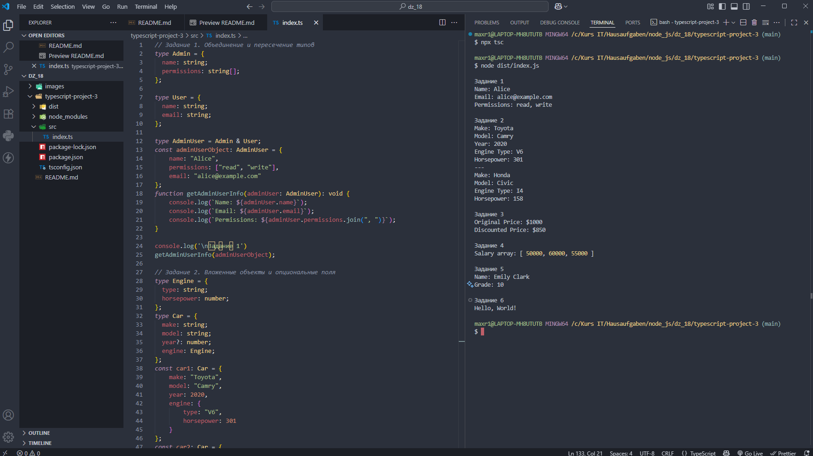

# Домашняя работа 18

### Задание 1. Объединение и пересечение типов

1. Создайте два типа: `Admin` и `User`.
  
2. Тип `Admin` должен включать поля `name` (строка) и `permissions` (массив строк), а тип `User` должен включать поля `name` (строка) и `email` (строка).
    
3. Создайте тип `AdminUser`, который объединяет свойства обоих типов, и создайте объект этого типа.

### Задание 2. Вложенные объекты и опциональные поля

1. Создайте объект `Car` с полями `make` (строка), `model` (строка), и вложенным объектом `engine`, который имеет поля `type` (строка) и `horsepower` (число).

2. Добавьте опциональное поле `year` (число) для года выпуска машины.
   
3. Напишите функцию, которая выводит информацию о машине.
    
    
### Задание 3. Интерфейс для функции с объектом

1. Создайте интерфейс для функции `calculateDiscount`, которая принимает объект `Product` с полями `name` (строка) и `price` (число), а также параметр `discount` (число).
   
2. Функция должна возвращать новую цену продукта с учетом скидки.
    
   
### Задание 4. Массив объектов и функции
  
1. Создайте интерфейс `Employee`, который включает поля `name` (строка) и `salary` (число).
  
2. Создайте массив объектов `Employee`, затем напишите функцию, которая принимает этот массив и возвращает массив зарплат всех сотрудников.

### Задание 5. Наследование интерфейсов и работа с объектами

1. Создайте интерфейс `Person` с полями `firstName` (строка) и `lastName` (строка).
  
2. Создайте интерфейс `Student`, который наследует `Person` и добавляет поле `grade` (число).
   
3. Создайте объект `student` этого типа и напишите функцию, которая выводит полное имя студента и его оценку.
    

### Задание 6. Интерфейс для функции с несколькими параметрами

1. Создайте интерфейс для функции `concatStrings`, которая принимает два параметра: `str1` и `str2` (оба строки) и возвращает их объединение.
    
2. Реализуйте эту функцию и протестируйте её.

---

---

