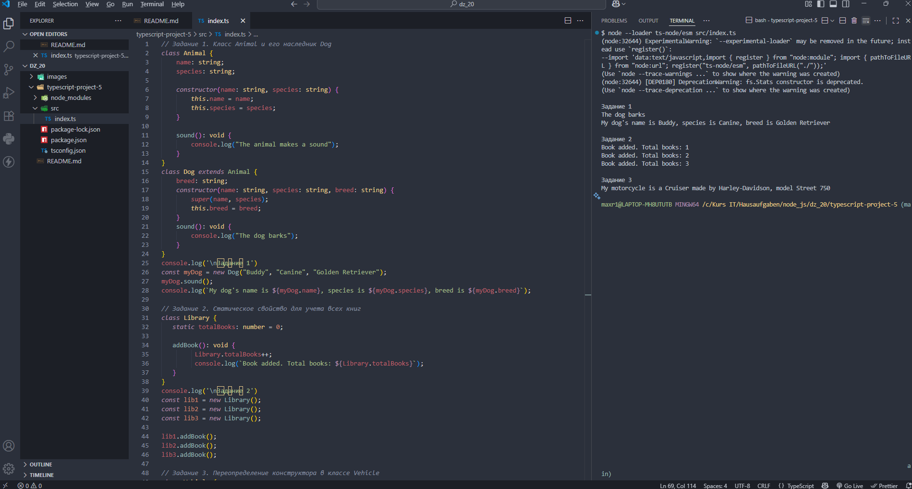

# Домашняя работа 20

### Задание 1. Класс `Animal` и его наследник `Dog`

1. Создайте класс `Animal`, который содержит свойства `name` (имя животного) и `species` (вид животного).

2. Добавьте метод `sound()`, который выводит в консоль `"The animal makes a sound"`.

3. Затем создайте класс-наследник `Dog`, который добавляет новое свойство `breed` (порода собаки) и переопределяет метод `sound()`, чтобы он выводил `"The dog barks"`.

### Задание 2. Статическое свойство для учета всех книг

1. Создайте класс `Library`, который имеет статическое свойство `totalBooks` (общее количество книг).

2. При каждом добавлении книги это свойство должно увеличиваться.

3. В классе также должен быть метод `addBook()`, который увеличивает счетчик книг.

4. Создайте несколько объектов класса и проверьте, как изменяется общее количество книг.

### Задание 3. Переопределение конструктора в классе `Vehicle`

1. Создайте класс `Vehicle`, который содержит свойства `make` (марка) и `model` (модель).

2. Добавьте конструктор, который инициализирует эти свойства.

3. Затем создайте класс-наследник `Motorcycle`, который добавляет новое свойство `type` (тип мотоцикла) и переопределяет конструктор для инициализации всех трех свойств.

4. Убедитесь, что данные правильно инициализируются при создании объекта.

---

---

