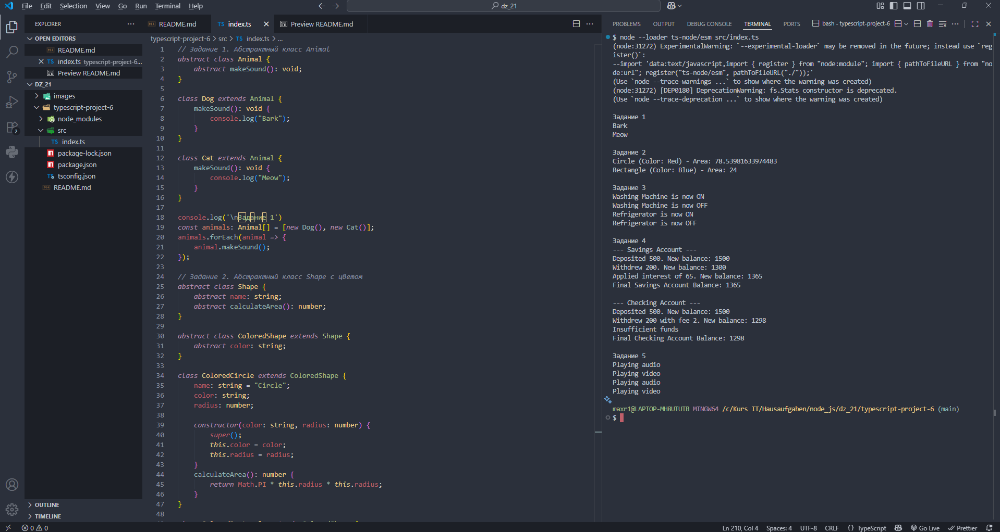

# Домашняя работа 21

### Задание 1. Абстрактный класс Animal

1. Создайте абстрактный класс `Animal` с абстрактным методом `makeSound()`.

2. Затем создайте классы `Dog` и `Cat`, которые наследуют `Animal` и реализуют метод `makeSound()` по-своему (`Dog` должен возвращать "Bark", а `Cat` — "Meow").

3. Создайте массив типа `Animal[]`, включающий объекты `Dog` и `Cat`, и вызовите метод `makeSound()` для каждого элемента массива.
  

### Задание 2. Абстрактный класс Shape с цветом

1. Создайте абстрактный класс `ColoredShape`, который наследует `Shape` (из задания 4 на уроке) и добавляет абстрактное поле `color`.

2. Реализуйте классы `ColoredCircle` и `ColoredRectangle`, которые наследуют `ColoredShape`, задают `color` и реализуют метод `calculateArea()`.

3. Выведите площадь и цвет для каждого объекта.

### Задание 3. Абстрактный класс Appliance

1. Создайте абстрактный класс `Appliance` с абстрактными методами `turnOn()` и `turnOff()`.

2. Затем создайте классы `WashingMachine` и `Refrigerator`, которые наследуют `Appliance` и реализуют методы `turnOn()` и `turnOff()`, выводя соответствующие сообщения.

3. Создайте массив типа `Appliance[]`, добавьте в него объекты `WashingMachine` и `Refrigerator`, и вызовите методы `turnOn()` и `turnOff()` для каждого элемента.

### Задание 4. Абстрактный класс Account

1. Создайте абстрактный класс `Account` с абстрактными методами `deposit(amount: number)` и `withdraw(amount: number)`.

2. Реализуйте классы `SavingsAccount` и `CheckingAccount`, которые наследуют `Account`.

3. В классе `SavingsAccount` добавьте логику для начисления процентов на остаток.

4. В классе `CheckingAccount` реализуйте снятие средств с учетом комиссии. 

5. Проверьте работу методов на объектах обоих классов.

### Задание 5. Абстрактный класс Media

1. Создайте абстрактный класс `Media` с абстрактным методом `play()`.

2. Затем создайте классы `Audio` и `Video`, которые наследуют `Media` и реализуют метод `play()` по-своему (например, `Audio` выводит "Playing audio", а `Video` — "Playing video").

3. Создайте массив типа `Media[]`, включающий объекты `Audio` и `Video`, и вызовите метод `play()` для каждого элемента массива.

---

---

