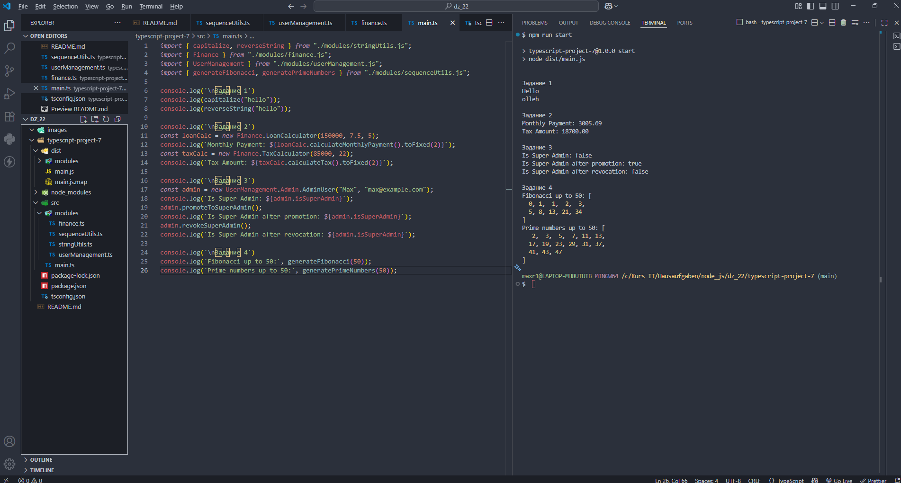

# Домашняя работа 22

### Задание 1. Модули для работы со строками

1. Создайте файл `stringUtils.ts`, в котором определите функции:

    `capitalize`, которая делает первую букву строки заглавной.

    `reverseString`, которая переворачивает строку задом наперед.

2. В файле `main.ts` импортируйте эти функции и протестируйте их на примерах строк.
 
### Задание 2. Пространства имен для финансовых операций

1. Создайте файл `finance.ts`, в котором определите пространство имен `Finance`. 

2. Внутри него создайте классы:

    `LoanCalculator`, который рассчитывает ежемесячные платежи по кредиту по формуле аннуитета.

    `TaxCalculator`, который рассчитывает налог на доход.

3. Используйте эти классы в файле `main.ts` для расчета платежей по кредиту и налога на примерных данных.
    
### Задание 3. Вложенные пространства имен для управления пользователями

1. Создайте файл `userManagement.ts`, в котором определите пространство имен `UserManagement`.

2. Внутри него создайте вложенное пространство имен `Admin`. Внутри `Admin` создайте класс `AdminUser`, который будет иметь свойства для имени, email и прав доступа (например, `isSuperAdmin`).

3. Также создайте методы для изменения прав доступа.

4. Используйте этот класс в файле `main.ts` для создания администратора и изменения его прав.

### Задание 4. Модули для работы с числовыми последовательностями

1. Создайте файл `sequenceUtils.ts`, в котором определите функции:

    `generateFibonacci`, которая генерирует последовательность Фибоначчи до указанного числа.

    `generatePrimeNumbers`, которая генерирует простые числа до указанного числа.

2. В файле `main.ts` импортируйте эти функции и протестируйте их на примерах.

---

---
