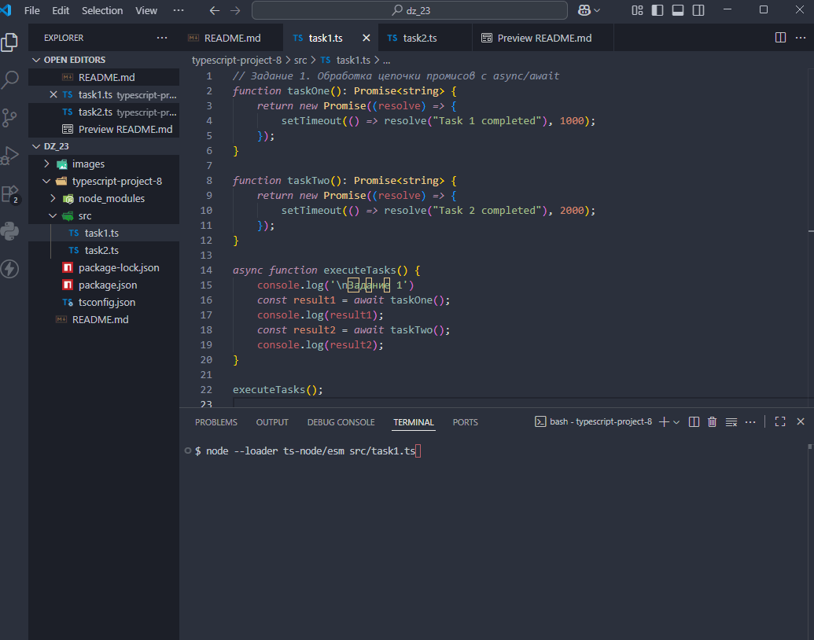
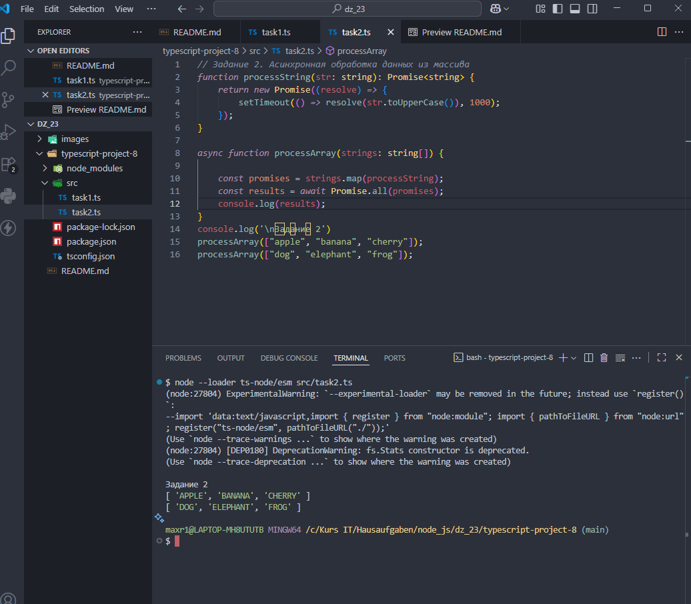
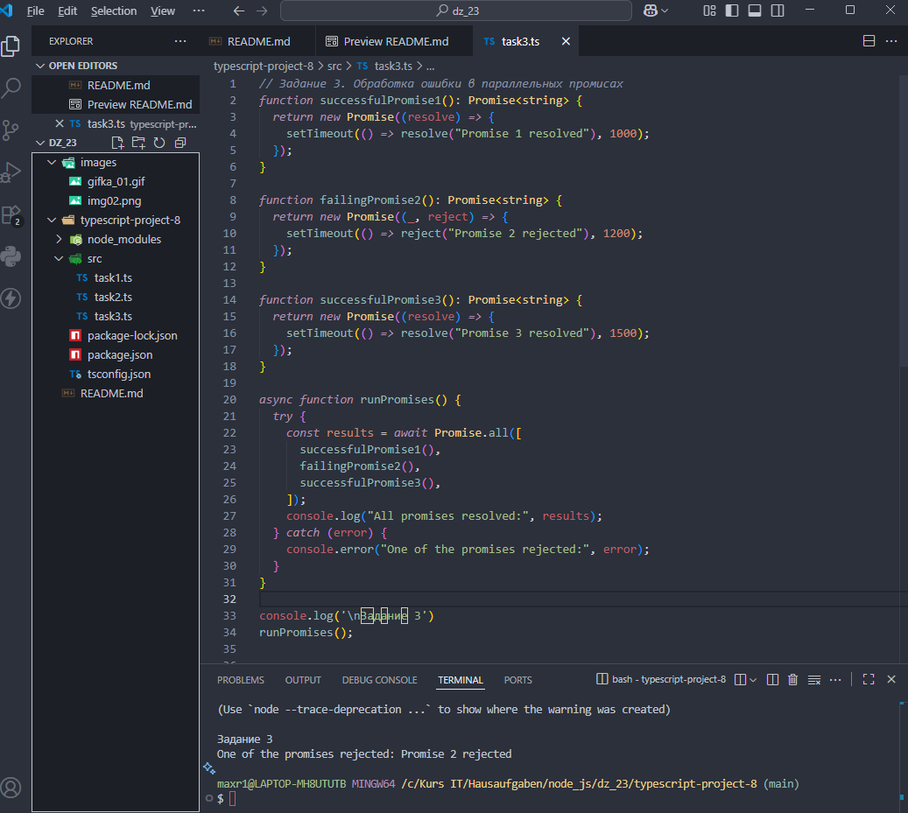
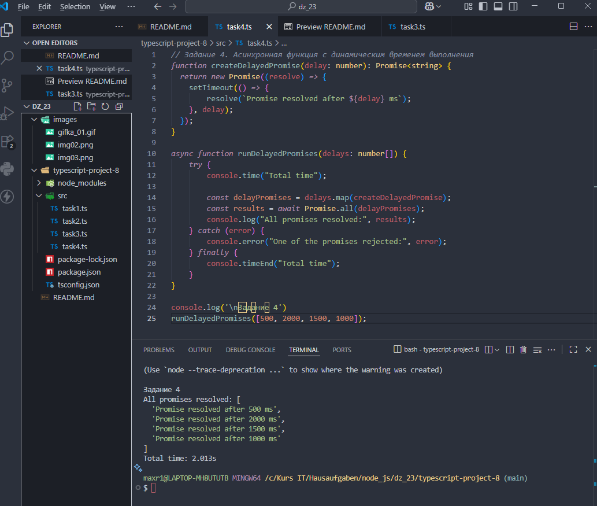

# Домашняя работа 23

### Задание 1. Обработка цепочки промисов с `async/await`

1. Создайте несколько функций, которые возвращают промисы с разным временем выполнения.

2. Напишите функцию, которая вызывает эти промисы поочерёдно, используя `await`, и обрабатывает результаты каждой операции.

3. Убедитесь, что цепочка промисов выполняется последовательно.

---

---

### Задание 2. Асинхронная обработка данных из массива

1. Напишите функцию, которая принимает массив строк.

2. Каждая строка будет асинхронно обрабатываться (например, преобразовываться в верхний регистр с задержкой).

3. Используйте `Promise.all` для выполнения всех операций параллельно и вывода всех результатов.

---

---

### Задание 3. Обработка ошибки в параллельных промисах

1. Напишите функцию, которая вызывает три промиса параллельно с помощью `Promise.all`.

2. Один из промисов должен намеренно завершиться с ошибкой через `reject`. 

3. Обработайте эту ошибку с использованием `try/catch` и выведите соответствующее сообщение.

---

---

### Задание 4. Асинхронная функция с динамическим временем выполнения

1. Напишите асинхронную функцию, которая принимает массив чисел.

2. Для каждого числа создайте промис, который будет завершаться через количество миллисекунд, равное значению числа.

3. Используйте `Promise.all` для ожидания завершения всех промисов и вывода результатов в консоль.

---

---
